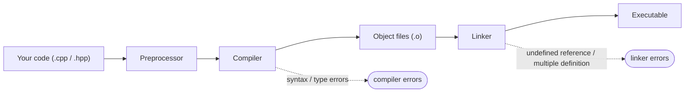
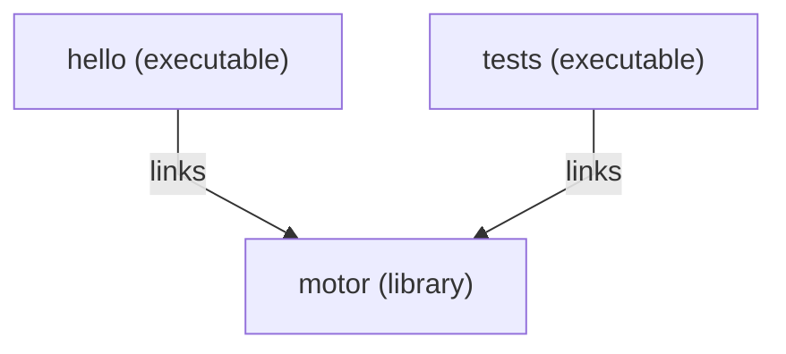

# CMake

So far you have run programs through CLion's green play button. That button is calling a build tool behind the scenes, and that tool is **CMake**.

CMake is not a compiler. It is one level above: you describe your project to CMake in a small file called `CMakeLists.txt`, and CMake generates the platform-specific instructions (Makefiles on Linux, Visual Studio project files on Windows, Xcode projects on macOS) that your compiler then follows. Write the project description once; build it anywhere.

> CMake makes the *build* portable, not the program it produces: the executable is still built for one operating system and CPU, and the same source is not guaranteed to compile on every compiler. [Portability](../portability.md) covers what does and does not carry across platforms.

Under that one button your code passes through several stages, and CMake's job is to drive them in order:



The stages also tell you *where* an error came from: the compiler complains about one file's syntax or types, while the linker complains only when it tries to stitch the object files together — see [Reading Compiler Errors](../compiler_errors.md).

CMake is the most widely used build system for C++ — most cross-platform projects and libraries you meet will use it. This chapter teaches the minimum you need today, then shows how it grows as your project does.

---

## The smallest CMake project

A single-file program needs three lines:

```cmake
cmake_minimum_required(VERSION 3.16)
project(hello)

add_executable(hello main.cpp)
```

That is it. Save as `CMakeLists.txt` next to `main.cpp`, and CLion (or `cmake -B build && cmake --build build` on the command line) will compile `main.cpp` into an executable called `hello`.

What each line does:

| Line | Meaning |
|------|---------|
| `cmake_minimum_required(VERSION 3.16)` | The oldest CMake version that can build this project. 3.16 is a sensible floor for modern C++. |
| `project(hello)` | Names the project. Must come before any targets. |
| `add_executable(hello main.cpp)` | Define an executable target named `hello`, built from `main.cpp`. |

You will copy this template into many projects. Get familiar with it.

---

## Setting the C++ standard

The default standard depends on the compiler, and it is rarely the one you want. Set it explicitly:

```cmake
cmake_minimum_required(VERSION 3.16)
project(hello)

set(CMAKE_CXX_STANDARD 20)
set(CMAKE_CXX_STANDARD_REQUIRED ON)

add_executable(hello main.cpp)
```

`CMAKE_CXX_STANDARD 20` tells the compiler to use C++20 (the standard this course teaches). `CMAKE_CXX_STANDARD_REQUIRED ON` makes it a hard requirement, without it, an older compiler would silently fall back to whatever it supports.

---

## Turn on compiler warnings

Several pages in this book tell you to "turn warnings on." A **warning** is the compiler flagging code that is legal but probably a mistake — `if (x = 5)` instead of `==`, a variable you declared and never used, a function that forgets to `return`. They are some of the most valuable feedback the compiler gives you, and most of them are **off by default**.

You switch them on with `target_compile_options` — but here is the catch this chapter has been hinting at: **the flag names differ between compilers.** GCC and Clang spell them one way, Microsoft's MSVC another:

| Compiler | Turn warnings on | Treat warnings as errors |
|----------|------------------|--------------------------|
| GCC, Clang (incl. CLion's MinGW) | `-Wall -Wextra` | `-Werror` |
| MSVC (Visual Studio) | `/W4` | `/WX` |

Hard-code `-Wall -Wextra` and your `CMakeLists.txt` breaks the moment someone builds it with MSVC — the very [non-portability](../portability.md) we want to avoid. The fix is to ask CMake *which* compiler it is using and choose the right flags. CMake sets the variable `MSVC` to true for Visual Studio, so an `if()` does the job:

```cmake
add_executable(hello main.cpp)

if(MSVC)
    target_compile_options(hello PRIVATE /W4)
else()
    target_compile_options(hello PRIVATE -Wall -Wextra)
endif()
```

Now warnings turn on whether the project is built with GCC, Clang, or MSVC. They appear in CLion's build window every time you compile — read them.

Once your code builds cleanly, you can make warnings **fatal**, so a warning stops the build instead of scrolling past. That flag differs too (`-Werror` vs `/WX`), so it goes in the same branches:

```cmake
if(MSVC)
    target_compile_options(hello PRIVATE /W4 /WX)
else()
    target_compile_options(hello PRIVATE -Wall -Wextra -Werror)
endif()
```

Making warnings fatal is stricter than you need on your first day, but it is a habit worth growing into: it guarantees you never ignore a warning by accident.

---

## Treating compilers and platforms differently

The warnings block above is one case of a general need: CMake describes the build *once*, but the right thing to do sometimes depends on **which compiler** or **which operating system** is doing the building. Plain `if()` blocks and a few built-in variables cover this.

To branch on the **compiler**:

| Check | True when |
|-------|-----------|
| `if(MSVC)` | the compiler is Microsoft's MSVC |
| `if(CMAKE_CXX_COMPILER_ID STREQUAL "GNU")` | the compiler is GCC |
| `if(CMAKE_CXX_COMPILER_ID STREQUAL "Clang")` | the compiler is Clang (Apple's build reports `"AppleClang"`) |

To branch on the **operating system**:

| Check | True on |
|-------|---------|
| `if(WIN32)` | Windows (even 64-bit) |
| `if(APPLE)` | macOS |
| `if(UNIX)` | Linux **and** macOS |

`APPLE` is also `UNIX`, so test `APPLE` first when you need to tell them apart:

```cmake
if(WIN32)
    target_compile_definitions(app PRIVATE PLATFORM_WINDOWS)
elseif(APPLE)
    target_compile_definitions(app PRIVATE PLATFORM_MAC)
elseif(UNIX)
    target_compile_definitions(app PRIVATE PLATFORM_LINUX)
endif()
```

`target_compile_definitions` defines a preprocessor macro — the CMake equivalent of writing `#define PLATFORM_WINDOWS` at the top of every file — so your C++ can select an OS-specific branch with `#ifdef PLATFORM_WINDOWS`.

Two rules keep this under control:

- **Use it only when you must.** Plain standard C++ already compiles everywhere; reach for a conditional only for the genuinely platform-specific parts — a compiler flag, a system library, an OS-only API. Most projects in this course need none beyond the warning flags above.
- **Test on every platform you branch for.** A `WIN32` block that has never been compiled on Windows is a guess, not a feature — see [Portability](../portability.md).

---

## Multiple source files

A real project quickly grows beyond one file. Suppose you have:

```
hello/
├── CMakeLists.txt
├── main.cpp
├── motor.cpp
└── motor.hpp
```

Just list the additional `.cpp` files in `add_executable`:

```cmake
add_executable(hello main.cpp motor.cpp)
```

Header files (`.hpp` / `.h`) are *not* listed, they are pulled in by `#include` lines in the source files. CMake only needs to know which `.cpp` files to compile.

For larger projects you can glob, but glob-based source lists do not pick up new files until CMake re-runs. Explicit lists are clearer:

```cmake
add_executable(hello
    main.cpp
    motor.cpp
    sensor.cpp
    controller.cpp
)
```

---

## Headers in a separate folder

A convention that pays off as projects grow:

```
hello/
├── CMakeLists.txt
├── include/
│   ├── motor.hpp
│   └── sensor.hpp
└── src/
    ├── main.cpp
    ├── motor.cpp
    └── sensor.cpp
```

Tell CMake where the headers live so `#include "motor.hpp"` works from inside any source file:

```cmake
add_executable(hello src/main.cpp src/motor.cpp src/sensor.cpp)
target_include_directories(hello PRIVATE include)
```

`target_include_directories(<target> PRIVATE <path>)` adds `<path>` to the list of folders the compiler searches for `#include`d files when building `<target>`.

`PRIVATE` means "this is only used to build this target." For executables this is always what you want. (You will see `PUBLIC` and `INTERFACE` when you start writing libraries that other code links to.)

---

## Building libraries

Once you have several executables that share code (your tests, your main program, perhaps a quick CLI tool), put the shared code in a **library** so it is compiled once:

```cmake
add_library(motor src/motor.cpp src/sensor.cpp)
target_include_directories(motor PUBLIC include)

add_executable(hello src/main.cpp)
target_link_libraries(hello PRIVATE motor)
```

One library, compiled once, shared by every executable that links it:



What changed:

- `add_library` defines a library target. By default it is a **static** library — its compiled code is baked into anything that links it (more on **static vs shared** just below).
- `target_link_libraries(hello PRIVATE motor)` tells CMake that the `hello` executable uses the `motor` library. The compiler now sees `motor`'s headers, and the linker now combines `motor`'s compiled code into `hello`.
- The library uses `PUBLIC` for its include directory, meaning anyone linking to `motor` *also* gets `motor`'s `include/` folder on their search path. That is what you want for a library's public headers.

### Static vs shared libraries

`add_library` builds a **static** library by default, and for your projects that is the right choice. The difference is *when* the library's compiled code joins your program:

- A **static** library (`.a`, or `.lib` on Windows) is copied *into* every executable that links it, at build time. You get one self-contained program — nothing extra to ship, and nothing that can go missing when it runs. The price is a larger executable, and you must relink to pick up a change in the library.
- A **shared** (or *dynamic*) library — `.dll` on Windows, `.so` on Linux, `.dylib` on macOS — stays a separate file. The executable only records that it *needs* it, and the system loads it when the program starts. Executables stay small, several programs can share one copy, and you can drop in a new version of the library without rebuilding them.

You pick with a keyword:

```cmake
add_library(motor STATIC src/motor.cpp)   # baked into the executable (the default)
add_library(motor SHARED src/motor.cpp)   # a separate .dll / .so / .dylib
```

The catch with shared libraries is the one that bites beginners: the program must *find* that library file at run time. On Windows it has to sit next to the `.exe`, or in a folder on your [PATH](../computer_basics.md#path-how-the-computer-finds-programs); Linux and macOS have their own library search paths. If the system cannot find it, the program refuses to start — *"DLL not found"* on Windows, *"error while loading shared libraries"* on Linux — even though it compiled and linked perfectly. A static build has nothing to locate at run time, so it never fails this way.

**Prefer static for course projects:** one file, nothing to lose, nothing to locate. Shared libraries earn their keep in larger systems — when many programs share one big library, or when a library must be updated on its own — and when a third-party dependency ships only as a `.dll`/`.so`, in which case you must place it where your program will find it.

> CMake also has a global switch, `BUILD_SHARED_LIBS`. Turn it `ON` and every `add_library` that does not say `STATIC` or `SHARED` explicitly builds shared; leave it alone and you get static — the sensible default here.

---

## Building from the command line

CLion drives CMake for you, but every CMake project can also be built directly:

```bash
# Configure: generate build files in a 'build/' folder
cmake -B build

# Build everything
cmake --build build

# Run the executable (path varies slightly by platform)
./build/hello              # Linux / macOS
./build/hello.exe          # Windows, CLion's bundled MinGW (single-config)
./build/Debug/hello.exe    # Windows with MSVC (multi-config)
```

The `-B build` flag puts all generated files into `build/` so they stay out of your source tree. Add `build/` to your `.gitignore` (or use `*/build` if you have nested projects).

---

## Build configurations: Debug and Release

A *build configuration* controls **how** your code is compiled — chiefly whether the optimiser runs and whether debugging information is kept. Two are standard:

| | Debug | Release |
|---|-------|---------|
| Optimisation | none (`-O0`) — quick to build, easy to step through | full (`-O2`/`-O3`) — quick to *run* |
| Debug info | full (`-g`) — the debugger sees every variable | stripped down |
| `assert` | active | removed (`NDEBUG` is defined — see [Error Handling](../Chapter6/error_handling.md#assertions-catching-bugs-not-handling-errors)) |
| Reach for it when | developing and [debugging](../debugger.md) | measuring speed, shipping |

Choose one when you configure the project:

```bash
cmake -B build -DCMAKE_BUILD_TYPE=Debug      # or -DCMAKE_BUILD_TYPE=Release
cmake --build build
```

In CLion you do not type that — the toolbar has a configuration selector, and it keeps a separate folder per configuration (`cmake-build-debug/`, `cmake-build-release/`) so switching between them does not rebuild everything. **Develop in Debug; switch to Release to measure performance or hand the program to someone else.**

> A program can pass in Debug and fail in Release (or the reverse). The usual culprit is an `assert` that caught the problem in Debug but is compiled out in Release, or the optimiser exposing a latent bug that happened to "work" unoptimised. That is a real bug in your code, not a compiler fault — hunt it down rather than retreating to the configuration that hid it.

---

## CMake options: making parts of the build optional

Sometimes part of the build should be optional. The common case is the **tests**: someone who only wants to run your program should not be forced to download a test framework. `option()` declares a switch the user can flip on or off:

```cmake
option(BUILD_TESTS "Build the unit tests" ON)

# the library and the program are always built
add_library(motor src/motor.cpp)
add_executable(app src/main.cpp)
target_link_libraries(app PRIVATE motor)

if(BUILD_TESTS)
    # configured only when BUILD_TESTS is ON
    add_executable(tests tests/test_motor.cpp)
    target_link_libraries(tests PRIVATE motor Catch2::Catch2WithMain)
endif()
```

`option(<NAME> "<description>" <default>)` creates a boolean that defaults to `ON` or `OFF`; everything inside the matching `if(<NAME>) … endif()` is configured only when it is on. The default holds unless someone overrides it on the command line:

```bash
cmake -B build -DBUILD_TESTS=OFF     # configure without the tests
```

This is how the [testing chapter](../Chapter6/testing.md)'s Catch2 setup is meant to be wired: put the Catch2 `FetchContent` lines *and* the test target inside the `if(BUILD_TESTS)` block, so the framework is downloaded and built **only** when you actually want to run tests.

> **Prefix the name to avoid clashes.** A bare `BUILD_TESTS` can collide with an option of the same name if your project is ever built *inside* a larger one. The convention is to prefix it with your project's name — `option(MOTOR_SIM_BUILD_TESTS "Build the unit tests" ON)` — so it stays unambiguous.

---

## A note on project layout

The layout below scales from one-file scripts to multi-library systems:

```
my_project/
├── CMakeLists.txt
├── README.md
├── .gitignore
├── include/        # public headers
├── src/            # implementation files
└── tests/          # tests (see Chapter 6)
```

You do not need all of these on day one. Start with one `main.cpp` and one `CMakeLists.txt`. Split into `src/` and `include/` when you have more than four or five files. Add `tests/` when you start writing tests. The point is to grow into the structure, not to set it all up before writing any code.

For a more elaborate convention used in larger industry projects, see [the Pitchfork Layout](https://joholl.github.io/pitchfork-website/).

---

## Splitting the build across folders

As a project grows, one big `CMakeLists.txt` at the top becomes hard to read. The fix is to give each folder its **own** `CMakeLists.txt` and have the top-level file pull them in with **`add_subdirectory`**:

```cmake
# top-level CMakeLists.txt
cmake_minimum_required(VERSION 3.16)
project(my_project)

set(CMAKE_CXX_STANDARD 20)
set(CMAKE_CXX_STANDARD_REQUIRED ON)

add_subdirectory(src)      # the library
add_subdirectory(app)      # the application that uses it
add_subdirectory(tests)    # the tests
```

`add_subdirectory(src)` means "there is another `CMakeLists.txt` in `src/` — go and run it." Each subfolder then defines its own targets, with the **library** and the **application** kept in separate folders:

```cmake
# src/CMakeLists.txt
add_library(my_lib motor.cpp sensor.cpp)
target_include_directories(my_lib PUBLIC ${CMAKE_SOURCE_DIR}/include)
```

```cmake
# app/CMakeLists.txt
add_executable(app main.cpp)
target_link_libraries(app PRIVATE my_lib)
```

```cmake
# tests/CMakeLists.txt
add_executable(tests test_motor.cpp)
target_link_libraries(tests PRIVATE my_lib)   # the library defined over in src/
```

Two things make this work:

- **Targets are visible across folders.** `my_lib` is created in `src/`, yet `app/` and `tests/` can link it — because `add_subdirectory(src)` ran first. Order matters: pull in `src` before the folders that use it.
- **`${CMAKE_SOURCE_DIR}`** is the top-level project folder, so `${CMAKE_SOURCE_DIR}/include` finds the shared headers from any subfolder.

The pay-off: each folder's build sits next to its code, and the top-level file becomes a short table of contents. The [Tank Control System](../tank_control/v5_tests.md) worked example uses exactly this layout once it grows a test suite.

---

## Summary

- `CMakeLists.txt` describes your project; CMake turns the description into platform-specific build files.
- Three lines suffice for a single-file program: `cmake_minimum_required`, `project`, `add_executable`.
- Set `CMAKE_CXX_STANDARD 20` explicitly.
- Put compiler- or OS-specific settings (such as warning flags) behind `if(MSVC)` / `if(WIN32)` / `if(APPLE)` / `if(UNIX)` blocks — and keep them to the genuinely platform-specific bits.
- Add more source files by listing them in `add_executable`. Headers do not need to be listed.
- Use `target_include_directories` when headers live in a separate folder.
- Use `add_library` and `target_link_libraries` once you have code shared between executables.
- Split a large build across folders by giving each its own `CMakeLists.txt` and wiring them together with `add_subdirectory`.
- Libraries are **static** by default — baked into the executable, nothing to ship; prefer that, and reach for a **shared** library (`.dll`/`.so`) only when you need it (and then the program must find it at run time).
- Keep build artefacts in a separate `build/` folder; ignore it in git.
- Pick a **build configuration** with `-DCMAKE_BUILD_TYPE` (or CLion's selector): **Debug** to develop and debug, **Release** to measure and ship.
- Make parts of the build optional with `option(NAME "…" ON)` and an `if(NAME)` block — e.g. gate the tests behind `BUILD_TESTS`.
