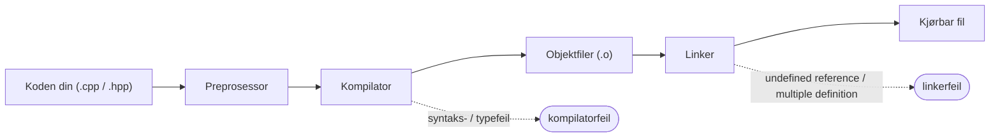
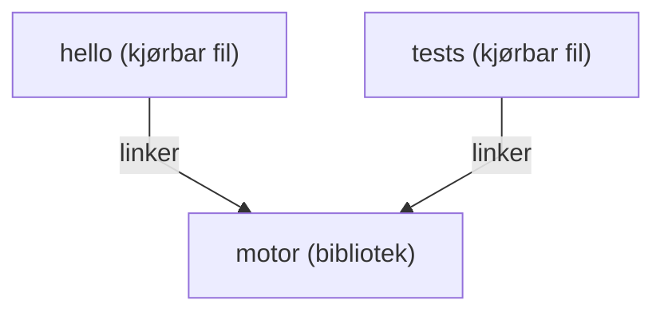

# CMake

Så langt har du kjørt programmer gjennom CLions grønne play-knapp. Bak den knappen sitter **CMake**.

CMake er ikke en kompilator, og det er heller ikke det som faktisk bygger programmet ditt. Det er en **byggesystem-generator**: du beskriver prosjektet ditt for CMake i en liten fil kalt `CMakeLists.txt`, og CMake genererer de plattformspesifikke instruksjonene (Makefiler på Linux, Visual Studio-prosjektfiler på Windows, Ninja-byggefiler, Xcode-prosjekter på macOS) som et *byggeverktøy* — Ninja, Make eller MSBuild — deretter følger for å kalle kompilatoren. Å trykke play kjører CMake først og så det byggeverktøyet, etter hverandre. CLions standard byggeverktøy er **Ninja**. Skriv prosjektbeskrivelsen én gang; bygg den hvor som helst.

> CMake gjør *bygget* portabelt, ikke programmet det produserer: den kjørbare filen bygges fortsatt for ett operativsystem og én CPU, og den samme kildekoden er ikke garantert å kompilere på hver kompilator. [Portabilitet](../portability.md) dekker hva som bærer over plattformgrensene og hva som ikke gjør det.

Under den ene knappen passerer koden din gjennom flere trinn, og CMakes jobb er å drive dem i rekkefølge:



Trinnene forteller deg også *hvor* en feil kom fra: kompilatoren klager på én fils syntaks eller typer, mens linkeren klager først når den prøver å sy objektfilene sammen — se [Lese kompilatorfeil](../compiler_errors.md).

CMake er det mest brukte byggesystemet for C++ — de fleste kryssplattformprosjekter og biblioteker du møter, kommer til å bruke det. Dette kapittelet lærer deg minimumet du trenger i dag, og viser deretter hvordan det vokser i takt med prosjektet ditt.

---

## Det minste CMake-prosjektet {#the-smallest-cmake-project}

Et program på én fil trenger tre linjer:

```cmake
cmake_minimum_required(VERSION 3.16)
project(hello)

add_executable(hello main.cpp)
```

Det er alt. Lagre som `CMakeLists.txt` ved siden av `main.cpp`, og CLion (eller `cmake -B build && cmake --build build` på kommandolinjen) kompilerer `main.cpp` til en kjørbar fil kalt `hello`.

Hva hver linje gjør:

| Linje | Betydning |
|------|---------|
| `cmake_minimum_required(VERSION 3.16)` | Den eldste CMake-versjonen som kan bygge dette prosjektet. 3.16 er et fornuftig gulv for moderne C++. |
| `project(hello)` | Gir prosjektet navn. Må komme før alle targets. |
| `add_executable(hello main.cpp)` | Definer et kjørbart target kalt `hello`, bygd fra `main.cpp`. |

Du kommer til å kopiere denne malen inn i mange prosjekter. Bli kjent med den.

---

## CMake i CLion {#cmake-in-clion}

CLion er bygd *rundt* CMake: `CMakeLists.txt` **er** prosjektet. Det har en håndfull praktiske konsekvenser, og å kjenne dem på forhånd sparer deg for mye hodebry.

**Å åpne et prosjekt betyr å åpne mappen.** Bruk **File → Open** og velg mappen som inneholder `CMakeLists.txt` (å velge selve filen fungerer også). Dette betyr mest når du [kloner et repo fra GitHub](version_control.md): åpne den klonede *mappen*, så finner CLion `CMakeLists.txt`, konfigurerer prosjektet, og den grønne ▶-knappen virker. Åpner du i stedet en enslig `.cpp`-fil, får du en editor uten noe prosjekt bak — ingenting å bygge, ingenting å kjøre.

**Å redigere `CMakeLists.txt` krever en ny innlasting.** CMake leser filen når den *konfigurerer* prosjektet, ikke kontinuerlig. Når du redigerer `CMakeLists.txt`, dukker det opp et banner øverst i editoren som tilbyr å laste prosjektet inn på nytt — klikk det, eller klikk **Enable auto-reload** én gang, så kjører CLion CMake på nytt av seg selv et øyeblikk etter hver endring. Før prosjektet er lastet inn på nytt, har endringen din **ingen effekt**. Dette er den aller vanligste "jeg la til filen, men den bygges fortsatt ikke."

<!-- skjermbilde: CLions reload-banner etter redigering av CMakeLists.txt -->

**Nye filer må stå oppført i et target.** Når du oppretter en fil med **File → New → C/C++ Source File**, viser CLion en avkrysningsboks **Add to targets** — la den stå avkrysset, så skriver CLion filen inn i `add_executable`-linjen din for deg. En fil som kommer inn på annen måte (kopiert inn fra filutforskeren, lastet ned) plukkes *ikke* opp automatisk: legg den til i listen i `CMakeLists.txt` selv, og last inn på nytt.

**Ett target, én oppføring i ▶-rullegardinmenyen.** Hver `add_executable` i prosjektet ditt blir en oppføring i rullegardinmenyen ved siden av den grønne play-knappen, og ▶ bygger og kjører det *valgte*. Når et prosjekt har flere programmer — en app og testene dens, for eksempel — sjekk den menyen før du konkluderer med at programmet ditt "ikke kjørte".

{ .screenshot }

**Feil dukker opp to forskjellige steder.** Feil i selve `CMakeLists.txt` er feil ved **konfigurering** (configure-time): de vises i **CMake**-verktøyvinduet nederst i CLion, i det øyeblikket prosjektet lastes (på nytt). Kompilator- og linkerfeil vises i **Build**-vinduet når du faktisk bygger. Trinndiagrammet ovenfor forteller deg *hvem* som klager; vinduet det vises i forteller deg *når* det gikk galt.

**Byggemappen kan trygt kastes.** Alt CMake og kompilatoren genererer havner i `cmake-build-debug/` (CLions standardnavn på `build/`-mappen). Hvis CMake noen gang havner i en forvirret tilstand — etter omdøpinger, flytting av prosjektet eller bytte av verktøykjede — bruk **Tools → CMake → Reset Cache and Reload Project**, eller bare slett `cmake-build-debug/`-mappen. Ingenting i den er ditt; neste bygg regenererer alt sammen.

---

## Sette C++-standarden {#setting-the-c-standard}

Hvilken standard som brukes hvis du ikke sier noe, avhenger av kompilatoren, og det er sjelden den du vil ha. Sett den eksplisitt:

```cmake
cmake_minimum_required(VERSION 3.16)
project(hello)

set(CMAKE_CXX_STANDARD 20)
set(CMAKE_CXX_STANDARD_REQUIRED ON)

add_executable(hello main.cpp)
```

`CMAKE_CXX_STANDARD 20` ber kompilatoren bruke C++20 (standarden dette emnet underviser i). `CMAKE_CXX_STANDARD_REQUIRED ON` gjør det til et hardt krav; uten den ville en eldre kompilator i stillhet falt tilbake til det den støtter.

---

## Slå på kompilator-advarsler {#turn-on-compiler-warnings}

Flere sider i denne boken ber deg "slå på advarsler". En **advarsel** er kompilatoren som flagger kode som er lovlig, men sannsynligvis en feil — `if (x = 5)` i stedet for `==`, en variabel du deklarerte og aldri brukte, en funksjon som glemmer å `return`-e. De er noe av den mest verdifulle tilbakemeldingen kompilatoren gir deg, og de fleste av dem er **av som standard**.

Du slår dem på med `target_compile_options` — men her er haken dette kapittelet har hintet om: **flaggnavnene er forskjellige mellom kompilatorer.** GCC og Clang staver dem på én måte, Microsofts MSVC på en annen:

| Kompilator | Slå på advarsler | Behandle advarsler som feil |
|----------|------------------|--------------------------|
| GCC, Clang (inkl. CLions MinGW) | `-Wall -Wextra` | `-Werror` |
| MSVC (Visual Studio) | `/W4` | `/WX` |

Hardkod `-Wall -Wextra`, og `CMakeLists.txt` ryker i det øyeblikket noen bygger den med MSVC — nøyaktig den [ikke-portabiliteten](../portability.md) vi vil unngå. Løsningen er å spørre CMake *hvilken* kompilator den bruker, og velge de riktige flaggene. CMake setter variabelen `MSVC` til sann for Visual Studio, så en `if()` gjør jobben:

```cmake
add_executable(hello main.cpp)

if(MSVC)
    target_compile_options(hello PRIVATE /W4)
else()
    target_compile_options(hello PRIVATE -Wall -Wextra)
endif()
```

Nå slås advarsler på enten prosjektet bygges med GCC, Clang eller MSVC. De vises i CLions Build-vindu hver gang du kompilerer — les dem.

Når koden din først bygger uten advarsler, kan du gjøre advarsler **fatale**, slik at en advarsel stopper bygget i stedet for å rulle forbi. Det flagget er også forskjellig (`-Werror` vs. `/WX`), så det går i de samme grenene:

```cmake
if(MSVC)
    target_compile_options(hello PRIVATE /W4 /WX)
else()
    target_compile_options(hello PRIVATE -Wall -Wextra -Werror)
endif()
```

Å gjøre advarsler fatale er strengere enn du trenger den første dagen, men det er en vane verdt å vokse inn i: den garanterer at du aldri overser en advarsel ved et uhell.

---

## Behandle kompilatorer og plattformer forskjellig {#treating-compilers-and-platforms-differently}

Advarselsblokken ovenfor er ett tilfelle av et generelt behov: CMake beskriver bygget *én gang*, men hva som er riktig å gjøre, avhenger noen ganger av **hvilken kompilator** eller **hvilket operativsystem** som bygger. Vanlige `if()`-blokker og noen få innebygde variabler dekker dette.

For å forgrene på **kompilatoren**:

| Sjekk | Sann når |
|-------|-----------|
| `if(MSVC)` | kompilatoren er Microsofts MSVC |
| `if(CMAKE_CXX_COMPILER_ID STREQUAL "GNU")` | kompilatoren er GCC |
| `if(CMAKE_CXX_COMPILER_ID STREQUAL "Clang")` | kompilatoren er Clang (Apples utgave rapporterer `"AppleClang"`) |

For å forgrene på **operativsystemet**:

| Sjekk | Sann på |
|-------|---------|
| `if(WIN32)` | Windows (også 64-bit) |
| `if(APPLE)` | macOS |
| `if(UNIX)` | Linux **og** macOS |

`APPLE` er også `UNIX`, så test `APPLE` først når du trenger å skille dem:

```cmake
if(WIN32)
    target_compile_definitions(app PRIVATE PLATFORM_WINDOWS)
elseif(APPLE)
    target_compile_definitions(app PRIVATE PLATFORM_MAC)
elseif(UNIX)
    target_compile_definitions(app PRIVATE PLATFORM_LINUX)
endif()
```

`target_compile_definitions` definerer en preprosessor-makro — CMake-ekvivalenten til å skrive `#define PLATFORM_WINDOWS` øverst i hver fil — slik at C++-koden din kan velge en OS-spesifikk gren med `#ifdef PLATFORM_WINDOWS`.

To regler holder dette under kontroll:

- **Bruk det bare når du må.** Vanlig standard C++ kompilerer allerede overalt; grip til en betingelse bare for de genuint plattformspesifikke delene — et kompilatorflagg, et systembibliotek, et API som bare finnes på ett OS. De fleste prosjekter i dette emnet trenger ingen utover advarselsflaggene ovenfor.
- **Test på hver plattform du forgrener for.** En `WIN32`-blokk som aldri har blitt kompilert på Windows, er en gjetning, ikke en funksjon — se [Portabilitet](../portability.md).

---

## Flere kildefiler {#multiple-source-files}

Et ekte prosjekt vokser raskt forbi én fil. Anta at du har:

```
hello/
├── CMakeLists.txt
├── main.cpp
├── motor.cpp
└── motor.hpp
```

Bare list opp de ekstra `.cpp`-filene i `add_executable`:

```cmake
add_executable(hello main.cpp motor.cpp)
```

Header-filer (`.hpp` / `.h`) listes *ikke* opp; de trekkes inn av `#include`-linjer i kildefilene. CMake trenger bare å vite hvilke `.cpp`-filer som skal kompileres.

For større prosjekter kan du bruke glob, men glob-baserte kildelister plukker ikke opp nye filer før CMake kjører på nytt. Eksplisitte lister er klarere:

```cmake
add_executable(hello
    main.cpp
    motor.cpp
    sensor.cpp
    controller.cpp
)
```

### Inni en header {#headers}

Hva er egentlig *i* `motor.hpp`? Husk [deklarasjoner vs. definisjoner](../Chapter1/functions.md#declarations-vs-definitions) fra kapittel 1: deklarasjonen forteller kompilatoren at en funksjon finnes; definisjonen leverer kroppen dens. En **header** er en fil som samler deklarasjoner flere kildefiler trenger å dele, og `#include "motor.hpp"` limer den inn i hvilken som helst fil som ber om det:

```cpp
// motor.hpp — deklarasjonene: hva som finnes
#pragma once

double motorRpm(int throttlePercent);
```

```cpp
// motor.cpp — definisjonene: hvordan det virker
#include "motor.hpp"

double motorRpm(int throttlePercent) {
    return throttlePercent * 42.0;
}
```

```cpp
// main.cpp — enhver fil som inkluderer headeren kan kalle funksjonen
#include <iostream>
#include "motor.hpp"

int main() {
    std::cout << motorRpm(50) << "\n";
}
```

Både `motor.cpp` og `main.cpp` kompileres (det er `add_executable`-listen); headeren limes inn i hver av dem. To konvensjoner i den lille headeren fortjener en ordentlig introduksjon, for hver header du noensinne skriver, bruker begge.

**`#pragma once` — include-guarden.** `#include` er en bokstavelig innliming, og i et ekte prosjekt ender én fil lett opp med å inkludere den samme headeren *to ganger* — én gang direkte, og én gang til gjennom en annen header som også inkluderer den. Kompilatoren ville da sett hver deklarasjon i den to ganger og avvist filen med en *redefinition*-feil. `#pragma once` på første linje forteller kompilatoren: "uansett hvor mange ganger denne filen etterspørres, lim den inn maksimalt én gang." Sett den øverst i **hver** header du skriver. Du kommer også til å møte den eldre stavemåten av den samme ideen i andres kode — særlig i Arduino-biblioteker og eldre veiledninger:

```cpp
#ifndef MOTOR_HPP
#define MOTOR_HPP
// ... headerens innhold ...
#endif
```

Det er en include-guard bygd av preprosessor-betingelser: den første innlimingen definerer makroen `MOTOR_HPP`, og `#ifndef` ("if not defined" — hvis ikke definert) får hver senere innliming til å hoppe rett til `#endif`. Den gjør nøyaktig samme jobb som `#pragma once`, til prisen av tre linjer og et makronavn du må holde unikt. `#pragma once` er teknisk sett ikke en del av C++-standarden, men hver kompilator du kommer til å møte, støtter den — skriv den i dine egne headere, og bare gjenkjenn `#ifndef`-formen når du ser den.

**`.h` eller `.hpp`?** Begge er header-filer, og kompilatoren behandler dem identisk — endelsen er ren konvensjon. `.h` er arvet fra C, så det er det C-biblioteker (og Arduino-verdenen) bruker; `.hpp` signaliserer "her er det C++ inni". Denne boken bruker **`.hpp`** for sine egne headere, slik at en leser kan se med ett blikk hvilke headere som er C++. Vær obs i CLion: **File → New → C/C++ Header File** foreslår `.h` som standard — navngi filen med `.hpp` selv (du kan endre standarden under **Settings → Editor → Code Style → C/C++**, på fanen **New File Extensions**).

---

## Headere i en egen mappe {#headers-in-a-separate-folder}

En konvensjon som lønner seg etter hvert som prosjekter vokser:

```
hello/
├── CMakeLists.txt
├── include/
│   ├── motor.hpp
│   └── sensor.hpp
└── src/
    ├── main.cpp
    ├── motor.cpp
    └── sensor.cpp
```

Fortell CMake hvor headerne bor, slik at `#include "motor.hpp"` virker fra innsiden av enhver kildefil:

```cmake
add_executable(hello src/main.cpp src/motor.cpp src/sensor.cpp)
target_include_directories(hello PRIVATE include)
```

`target_include_directories(<target> PRIVATE <path>)` legger `<path>` til i listen over mapper kompilatoren søker i etter `#include`-ede filer når `<target>` bygges.

`PRIVATE` betyr "dette brukes bare til å bygge dette targetet." For kjørbare filer er det alltid det du vil ha. (Du kommer til å se `PUBLIC` og `INTERFACE` når du begynner å skrive biblioteker som annen kode linker mot.)

---

## Bygge biblioteker {#building-libraries}

Når du har flere kjørbare filer som deler kode (testene dine, hovedprogrammet ditt, kanskje et kjapt kommandolinjeverktøy), legg den delte koden i et **bibliotek** slik at den kompileres én gang:

```cmake
add_library(motor src/motor.cpp src/sensor.cpp)
target_include_directories(motor PUBLIC include)

add_executable(hello src/main.cpp)
target_link_libraries(hello PRIVATE motor)
```

Ett bibliotek, kompilert én gang, delt av hver kjørbare fil som linker det:



Hva som endret seg:

- `add_library` definerer et bibliotek-target. Som standard er det et **statisk** bibliotek — den kompilerte koden dets bakes inn i alt som linker det (mer om **statisk vs. delt** rett nedenfor).
- `target_link_libraries(hello PRIVATE motor)` forteller CMake at den kjørbare filen `hello` bruker biblioteket `motor`. Kompilatoren ser nå `motor` sine headere, og linkeren kombinerer nå `motor` sin kompilerte kode inn i `hello`.
- Biblioteket bruker `PUBLIC` for include-mappen sin, som betyr at alle som linker mot `motor`, *også* får `motor` sin `include/`-mappe på søkestien sin. Det er det du vil ha for et biblioteks offentlige headere.

### Statiske vs. delte biblioteker {#static-vs-shared-libraries}

`add_library` bygger et **statisk** bibliotek som standard, og for dine prosjekter er det riktig valg. Forskjellen er *når* bibliotekets kompilerte kode blir en del av programmet ditt:

- Et **statisk** bibliotek (`.a`, eller `.lib` på Windows) kopieres *inn i* hver kjørbare fil som linker det, ved byggetid. Du får ett selvstendig program — ingenting ekstra å levere med, og ingenting som kan mangle når det kjører. Prisen er en større kjørbar fil, og du må linke på nytt for å få med en endring i biblioteket.
- Et **delt** (eller *dynamisk*) bibliotek — `.dll` på Windows, `.so` på Linux, `.dylib` på macOS — forblir en egen fil. Den kjørbare filen noterer bare at den *trenger* det, og systemet laster det når programmet starter. Kjørbare filer holder seg små, flere programmer kan dele én kopi, og du kan bytte inn en ny versjon av biblioteket uten å bygge dem på nytt.

Du velger med et nøkkelord:

```cmake
add_library(motor STATIC src/motor.cpp)   # bakes inn i den kjørbare filen (standard)
add_library(motor SHARED src/motor.cpp)   # en egen .dll / .so / .dylib
```

Haken med delte biblioteker er den som biter nybegynnere: programmet må *finne* den bibliotekfilen ved kjøring. På Windows må den ligge ved siden av `.exe`-filen, eller i en mappe på din [PATH](../computer_basics.md#path-how-the-computer-finds-programs); Linux og macOS har sine egne søkestier for biblioteker. Hvis systemet ikke finner den, nekter programmet å starte — *"DLL not found"* på Windows, *"error while loading shared libraries"* på Linux — selv om det kompilerte og linket perfekt. Et statisk bygg har ingenting å lokalisere ved kjøring, så det feiler aldri på denne måten.

**Foretrekk statisk for emneprosjekter:** én fil, ingenting å miste, ingenting å lokalisere. Delte biblioteker gjør nytte for seg i større systemer — når mange programmer deler ett stort bibliotek, eller når et bibliotek må kunne oppdateres for seg selv — og når en tredjeparts avhengighet bare leveres som en `.dll`/`.so`, og da må du legge den der programmet ditt finner den.

> CMake har også en global bryter, `BUILD_SHARED_LIBS`. Slå den `ON`, og hver `add_library` som ikke sier `STATIC` eller `SHARED` eksplisitt, bygger delt; la den være i fred, og du får statisk — den fornuftige standarden her.

---

## Bruke tredjepartsbiblioteker {#consuming-third-party-libraries}

Før eller senere vil du ha et bibliotek noen andre har skrevet — et testrammeverk, et formateringsbibliotek, et mattebibliotek. Den enkleste måten å trekke ett inn i et CMake-prosjekt på er **`FetchContent`**: du navngir et git-repository og en versjon, og CMake laster ned og bygger det som en del av ditt eget bygg. Her er hele mønsteret, som henter [Catch2](https://github.com/catchorg/Catch2) (testrammeverket [testkapittelet](../Chapter6/testing.md) bruker):

```cmake
include(FetchContent)

FetchContent_Declare(
    Catch2
    GIT_REPOSITORY https://github.com/catchorg/Catch2.git
    GIT_TAG        v3.5.2                      # lås en versjon, aldri en bevegelig branch
)
FetchContent_MakeAvailable(Catch2)

add_executable(tests test_motor.cpp)
target_link_libraries(tests PRIVATE Catch2::Catch2WithMain)
```

Fire steg: `include(FetchContent)` laster funksjonaliteten; `FetchContent_Declare` sier *hvor* avhengigheten bor og *hvilken* versjon; `FetchContent_MakeAvailable` laster ned og bygger den; deretter kjører du `target_link_libraries` mot et target avhengigheten eksporterer.

**Hva `Catch2::Catch2WithMain` betyr.** Det `namespace::target`-navnet er et target det hentede prosjektet *eksporterer* for at du skal linke det. Å linke det gjør alt på én gang: kompilatoren får Catch2 sine include-stier (slik at `#include <catch2/catch_test_macros.hpp>` løses opp), og linkeren får den kompilerte koden dets. Du jakter aldri på header-mapper eller `.lib`-filer for hånd — den ene `target_link_libraries`-linjen tar med seg hele pakken. (`::` er bare en navnekonvensjon som markerer det som et importert target, ikke et av dine egne.)

**Det første bygget er tregt.** Første gang du konfigurerer et prosjekt med en ny `FetchContent`-avhengighet, kloner CMake repositoryet og kompilerer det — det krever internettforbindelse og kan ta et minutt eller to. Etter det er det mellomlagret i `build/`-mappen din, og konfigureringen går raskt igjen.

**Alternativer, bare nevnt ved navn.** To andre tilnærminger finnes: `find_package`, som lokaliserer et bibliotek som allerede er *installert* på maskinen (vanlig på Linux, der systemets pakkebehandler leverer det), og dedikerte C++-pakkebehandlere som **vcpkg** og **Conan**. De betyr noe i større prosjekter og teamprosjekter; dette emnet trenger bare `FetchContent`.

**To feillukter.** Å vite *når* en feil dukker opp, forteller deg hva som gikk galt:

- En feil ved **konfigurering** (når CMake kjører, før noe kompileres) — vanligvis en skrivefeil i `FetchContent_Declare`, feil repository-URL eller -tag, eller ikke noe nettverk å laste ned fra.
- `undefined reference` ved **linking** (koden kompilerte, men linkeren finner ikke bibliotekets funksjoner) — du hentet avhengigheten, men glemte `target_link_libraries`-linjen, så ingenting ble faktisk linket.

---

## Bygge fra kommandolinjen {#building-from-the-command-line}

CLion kjører CMake for deg, men hvert CMake-prosjekt kan også bygges direkte:

```bash
# Konfigurer: generer byggefiler i en 'build/'-mappe
cmake -B build

# Bygg alt
cmake --build build

# Kjør den kjørbare filen (stien varierer litt mellom plattformer)
./build/hello              # Linux / macOS
./build/hello.exe          # Windows, CLions medfølgende MinGW (single-config)
./build/Debug/hello.exe    # Windows med MSVC (multi-config)
```

`-B build`-flagget legger alle genererte filer i `build/` slik at de holder seg unna kildetreet ditt. Legg `build/` i `.gitignore` — en naken `build/`-linje matcher en mappe med det navnet på et hvilket som helst nivå, så den dekker nestede prosjekter også.

---

## Byggekonfigurasjoner: Debug og Release {#build-configurations-debug-and-release}

En *byggekonfigurasjon* styrer **hvordan** koden din kompileres — først og fremst om optimalisereren kjører og om feilsøkingsinformasjonen beholdes. To er standard:

| | Debug | Release |
|---|-------|---------|
| Optimalisering | ingen (`-O0`) — rask å bygge, lett å steppe gjennom | full (`-O2`/`-O3`) — rask å *kjøre* |
| Feilsøkingsinfo | full (`-g`) — debuggeren ser hver variabel | strippet ned |
| `assert` | aktiv | fjernet (`NDEBUG` er definert — se [Feilhåndtering](../Chapter6/error_handling.md#assertions-catching-bugs-not-handling-errors)) |
| Grip til den når | du utvikler og [feilsøker](../debugger.md) | du måler hastighet, leverer fra deg |

Velg én når du konfigurerer prosjektet:

```bash
cmake -B build -DCMAKE_BUILD_TYPE=Debug      # eller -DCMAKE_BUILD_TYPE=Release
cmake --build build
```

> Med en **multi-config-generator** (Visual Studio) har `-DCMAKE_BUILD_TYPE` ingen effekt — én byggemappe rommer hver konfigurasjon, og du velger én ved byggetid i stedet: `cmake --build build --config Debug`. Single-config-generatorer (Ninja, Make) bruker `-DCMAKE_BUILD_TYPE` som vist.

I CLion skriver du ikke dette — verktøylinjen har en konfigurasjonsvelger, og den holder en egen mappe per konfigurasjon (`cmake-build-debug/`, `cmake-build-release/`) slik at det å bytte mellom dem ikke bygger alt på nytt. **Utvikle i Debug; bytt til Release for å måle ytelse eller gi programmet til noen andre.**

> Et program kan passere i Debug og feile i Release (eller omvendt). Den vanlige synderen er en `assert` som fanget problemet i Debug, men er kompilert bort i Release, eller optimalisereren som avdekker en latent feil som tilfeldigvis "virket" uoptimalisert. Det er en ekte feil i koden din, ikke en kompilatorfeil — jakt den ned i stedet for å trekke deg tilbake til konfigurasjonen som skjulte den.

---

## CMake-opsjoner: gjøre deler av bygget valgfrie {#cmake-options-making-parts-of-the-build-optional}

Noen ganger bør en del av bygget være valgfri. Det vanlige tilfellet er **testene**: en som bare vil kjøre programmet ditt, bør ikke tvinges til å laste ned et testrammeverk. `option()` deklarerer en bryter brukeren kan slå på eller av:

```cmake
option(BUILD_TESTS "Build the unit tests" ON)

# biblioteket og programmet bygges alltid
add_library(motor src/motor.cpp)
add_executable(app src/main.cpp)
target_link_libraries(app PRIVATE motor)

if(BUILD_TESTS)
    # konfigureres bare når BUILD_TESTS er ON
    add_executable(tests tests/test_motor.cpp)
    target_link_libraries(tests PRIVATE motor Catch2::Catch2WithMain)
endif()
```

`Catch2::Catch2WithMain` er ikke et av dine egne targets — det er et target fra en hentet avhengighet, testrammeverket Catch2. Se [Bruke tredjepartsbiblioteker](#consuming-third-party-libraries) ovenfor for hvordan et slikt navn kommer inn i bygget ditt.

`option(<NAME> "<description>" <default>)` oppretter en boolsk verdi som har `ON` eller `OFF` som standard; alt inne i den tilhørende `if(<NAME>) … endif()` konfigureres bare når den er på. Standarden gjelder med mindre noen overstyrer den på kommandolinjen:

```bash
cmake -B build -DBUILD_TESTS=OFF     # konfigurer uten testene
```

Slik er [testkapittelets](../Chapter6/testing.md) Catch2-oppsett ment å kobles: legg Catch2 sine `FetchContent`-linjer *og* test-targetet inne i `if(BUILD_TESTS)`-blokken, slik at rammeverket lastes ned og bygges **bare** når du faktisk vil kjøre tester.

> **Prefiks navnet for å unngå kollisjoner.** En naken `BUILD_TESTS` kan kollidere med en opsjon med samme navn hvis prosjektet ditt noen gang bygges *inne i* et større et. Konvensjonen er å prefikse den med prosjektnavnet ditt — `option(MOTOR_SIM_BUILD_TESTS "Build the unit tests" ON)` — slik at den forblir entydig.

---

## En merknad om prosjektoppsett {#a-note-on-project-layout}

Oppsettet nedenfor skalerer fra énfilsskript til systemer med flere biblioteker:

```
my_project/
├── CMakeLists.txt
├── README.md
├── .gitignore
├── include/        # offentlige headere
├── src/            # implementasjonsfiler
└── tests/          # tester (se kapittel 6)
```

Du trenger ikke alle disse fra dag én. Start med én `main.cpp` og én `CMakeLists.txt`. Del opp i `src/` og `include/` når du har mer enn fire–fem filer. Legg til `tests/` når du begynner å skrive tester. Poenget er å vokse inn i strukturen, ikke å sette opp alt før du skriver noe kode.

For en mer forseggjort konvensjon brukt i større industriprosjekter, se [Pitchfork-oppsettet](https://joholl.github.io/pitchfork-website/).

---

## Dele opp bygget over flere mapper {#splitting-the-build-across-folders}

Etter hvert som et prosjekt vokser, blir én stor `CMakeLists.txt` på toppen vanskelig å lese. Løsningen er å gi hver mappe sin **egen** `CMakeLists.txt` og la toppnivåfilen trekke dem inn med **`add_subdirectory`**:

```cmake
# CMakeLists.txt på toppnivå
cmake_minimum_required(VERSION 3.16)
project(my_project)

set(CMAKE_CXX_STANDARD 20)
set(CMAKE_CXX_STANDARD_REQUIRED ON)

add_subdirectory(src)      # biblioteket
add_subdirectory(app)      # applikasjonen som bruker det
add_subdirectory(tests)    # testene
```

`add_subdirectory(src)` betyr "det finnes en annen `CMakeLists.txt` i `src/` — gå og kjør den." Hver undermappe definerer så sine egne targets, med **biblioteket** og **applikasjonen** holdt i separate mapper:

```cmake
# src/CMakeLists.txt
add_library(my_lib motor.cpp sensor.cpp)
target_include_directories(my_lib PUBLIC ${PROJECT_SOURCE_DIR}/include)
```

```cmake
# app/CMakeLists.txt
add_executable(app main.cpp)
target_link_libraries(app PRIVATE my_lib)
```

```cmake
# tests/CMakeLists.txt
add_executable(tests test_motor.cpp)
target_link_libraries(tests PRIVATE my_lib)   # biblioteket definert borte i src/
```

To ting får dette til å virke:

- **Targets er synlige på tvers av mapper.** `my_lib` opprettes i `src/`, men `app/` og `tests/` kan likevel linke det. Du trenger ikke definere et target før linjen som linker det: CMake løser opp target-navn når det genererer bygget på *slutten* av konfigureringen, så et navn i `target_link_libraries` finner targetet sitt uansett hvor det er definert. Å legge `src` foran mappene som bruker det, er likevel den riktige vanen — det holder filen lesbar og speiler rekkefølgen ting bygges i — men det er konvensjon, ikke et krav.
- **`${PROJECT_SOURCE_DIR}`** er mappen til det nærmeste `project()`-kallet, så `${PROJECT_SOURCE_DIR}/include` finner de delte headerne fra enhver undermappe. (Foretrekk den fremfor `${CMAKE_SOURCE_DIR}`, som peker på det *ytterste* prosjektet og ryker hvis dette prosjektet noen gang trekkes inn i et større et med `add_subdirectory`.)

Gevinsten: hver mappes bygg ligger ved siden av koden sin, og toppnivåfilen blir en kort innholdsfortegnelse. Det gjennomarbeidede eksempelet [Tankstyringssystemet](../tank_control/v5_tests.md) bruker nøyaktig dette oppsettet når det vokser til å få en testsuite.

---

## Når bygget ryker {#when-the-build-breaks}

Fem feil står for nesten hvert eneste CMake-problem studenter kommer til laben med. Finn symptomet som passer, bruk løsningen.

**`Cannot find source file: motor.cpp`** — en feil ved *konfigurering* (CMake-verktøyvinduet, før noe kompileres). `CMakeLists.txt` navngir en fil som ikke er der den sier: en skrivefeil i navnet, eller filen bor i en undermappe (`src/motor.cpp`) mens listen sier `motor.cpp`. Stier i `add_executable` er relative til den `CMakeLists.txt` som inneholder dem — fiks stien, last inn på nytt.

**`undefined reference to 'motorRpm()'`** — en feil ved *linking* (Build-vinduet, etter at alt kompilerte). Linkeren fikk aldri den kompilerte kroppen til den funksjonen. Nesten alltid: du skrev `motor.cpp`, men glemte å liste den i `add_executable`, eller du glemte `target_link_libraries`-linjen for biblioteket som inneholder den. Legg den til, last inn på nytt, bygg på nytt. Merk villedningen: feilen rapporteres på filen som *kaller* funksjonen, og det er ikke filen du må fikse.

**`multiple definition of 'main'`** — også ved linking. To kildefiler i det *samme* targetet definerer hver sin `main`; linkeren kan ikke velge én. To programmer betyr to targets: gi hver fil sin egen `add_executable`, akkurat som i [oppgave 1](exercises.md#1-a-project-with-two-programs).

**"Jeg endret koden, men programmet oppfører seg som før."** To vanlige årsaker, begge i CLion: ▶-rullegardinmenyen er satt til et *annet* target enn det du redigerte, eller du endret `CMakeLists.txt` og lastet aldri inn på nytt, så bygget følger fortsatt den gamle beskrivelsen.

**"Det bygger og kjører, men finner ikke filen min."** Programmet åpner `data.txt`, får ingenting — fordi det kjører *inne i* `cmake-build-debug/`, og relative stier løses derfra, ikke fra kildemappen din. Det er et [arbeidskatalog](../computer_basics.md#the-working-directory)-problem, ikke et CMake-problem: se eller endre den under **Run → Edit Configurations → Working directory**.

Og når symptomet ikke passer noe som helst — prosjektet var i orden i går, og ingenting du har endret forklarer det — nullstill: **Tools → CMake → Reset Cache and Reload Project**, eller slett `cmake-build-debug/` og la den regenereres. En utdatert cache etter omdøpinger eller verktøykjede-bytter gir nøyaktig denne typen uforklarlig havari, og nullstillingen koster ingenting.

---

## Oppsummering {#summary}

- `CMakeLists.txt` beskriver prosjektet ditt; CMake gjør beskrivelsen om til plattformspesifikke byggefiler.
- Tre linjer holder for et énfilsprogram: `cmake_minimum_required`, `project`, `add_executable`.
- Sett `CMAKE_CXX_STANDARD 20` eksplisitt.
- Legg kompilator- eller OS-spesifikke innstillinger (som advarselsflagg) bak `if(MSVC)` / `if(WIN32)` / `if(APPLE)` / `if(UNIX)`-blokker — og begrens dem til de genuint plattformspesifikke bitene.
- Legg til flere kildefiler ved å liste dem i `add_executable`. Headere trenger ikke å listes.
- Bruk `target_include_directories` når headere bor i en egen mappe.
- Bruk `add_library` og `target_link_libraries` når du har kode som deles mellom kjørbare filer.
- Trekk inn et tredjepartsbibliotek med `FetchContent` (`FetchContent_Declare` + `FetchContent_MakeAvailable`), og link deretter targetet det eksporterer (`ns::target`).
- Del et stort bygg over flere mapper ved å gi hver mappe sin egen `CMakeLists.txt` og koble dem sammen med `add_subdirectory`.
- Biblioteker er **statiske** som standard — bakt inn i den kjørbare filen, ingenting å levere med; foretrekk det, og grip til et **delt** bibliotek (`.dll`/`.so`) bare når du trenger det (og da må programmet finne det ved kjøring).
- I CLion: endringer i `CMakeLists.txt` trer i kraft først etter en **ny innlasting**; hver ny fil må listes i et target; ▶-rullegardinmenyen avgjør hvilket target som kjøres.
- Hold byggeartefakter i en egen `build/`-mappe; ignorer den i git. Mappen kan trygt kastes — å slette den (eller **Reset Cache and Reload Project**) kurerer en forvirret CMake.
- Velg en **byggekonfigurasjon** med `-DCMAKE_BUILD_TYPE` (eller CLions velger): **Debug** for å utvikle og feilsøke, **Release** for å måle og levere.
- Gjør deler av bygget valgfrie med `option(NAME "…" ON)` og en `if(NAME)`-blokk — f.eks. legg testene bak `BUILD_TESTS`.
