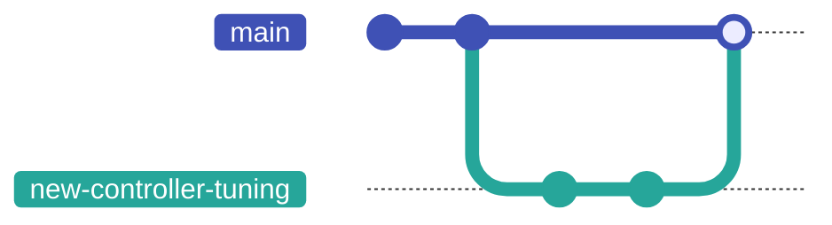

# Version Control with Git

Version control is the system that lets you take **snapshots** of your project as it evolves: every time you reach a working state, you save it. If you break something later, you can return to the snapshot. If you work with others, version control coordinates everyone's changes so they do not overwrite each other.

The tool you will use for this — in this course, in your degree, and in industry — is **Git**.

This chapter introduces the concepts, walks through the commands you need on day one, and then shows where the same operations live in CLion — which is where you will do most of your daily git work.

---

## The concepts

A **repository** (or "repo") is your project plus its complete history of changes. It lives in a `.git/` folder at the root of the project; you never look inside it directly. The repo is a self-contained timeline.

A **commit** is one snapshot. Each commit records:

- the full state of the project at that moment (git stores the complete snapshot, not a list of edits — the "what changed" you see in `git diff` is worked out on demand by comparing two snapshots),
- a message describing the change (written by you),
- a unique identifier (a 40-character hash),
- the commit that came before it (its "parent").

A **branch** is a line of development. The first branch is conventionally called `main`, though a plain `git init` still names it `master` unless you have told git otherwise — run `git config --global init.defaultBranch main` once and every new repo starts on `main`. You can create new branches to work on a feature without disturbing `main`, then merge your work back when it is ready.

A **remote** is a copy of your repo on another machine (usually GitHub). You **push** your commits up to the remote to share them; you **pull** to get commits others have pushed.

That is the whole model. Repo, commits, branches, remotes.

---

## Configuring git (once per machine)

Before your first commit, tell git who you are. This information goes into every commit you make:

```bash
git config --global user.name "Your Name"
git config --global user.email "your.email@stud.ntnu.no"
```

`--global` means "for every git repo on this machine." Set it once, forget it.

---

## A typical first day with a repo

The commands below are the ones you will type ten times a day. Get comfortable with them.

### Starting a new project

```bash
git init                  # turn the current folder into a git repo
git status                # see what git thinks the state is
```

### Saving your work (a commit)

```bash
git add CMakeLists.txt main.cpp     # stage these files for the next commit
git status                          # check what is staged
git commit -m "Initial Hello World" # record a snapshot with a message
```

`git add` does *not* save anything yet; it just marks files for inclusion. `git commit` is the snapshot. The `-m` flag attaches a short message.

> Write commit messages that explain *why* you made the change, not just *what* changed. "Fix off-by-one in motor PID loop" is far more useful three months later than "fix bug" or "update file."

To see the history:

```bash
git log
git log --oneline    # compact view
```

### Working with a remote (GitHub)

For the remote you will use **GitHub** — in this course and, most likely, for the rest of your career. If you do not have an account yet, sign up at [github.com](https://github.com) (any email works; you can add your NTNU address later for student benefits).

#### Set up SSH access (once per machine)

When your computer talks to GitHub, it has to prove who you are. In this course we use **SSH keys** for that: a pair of files — a *private* key that never leaves your machine, and a *public* key you hand to GitHub. Set it up once and every clone, push, and pull afterwards just works, with no passwords or login prompts, in the terminal and in CLion alike. The setup is four short steps; do them slowly and in order.

**1. Generate the key pair.** Open a terminal (on Windows, PowerShell — or the **Terminal** tab at the bottom of CLion) and run:

```bash
ssh-keygen -t ed25519 -C "your.email@stud.ntnu.no"
```

It asks where to save the key and for a passphrase — press **Enter** at every prompt to accept the defaults. This creates two files in the hidden `.ssh` folder inside your home folder:

- `id_ed25519` — the **private** key. Never share it, never commit it, never paste it anywhere.
- `id_ed25519.pub` — the **public** key. This is the one GitHub gets (`.pub` as in *public*).

**2. Copy the public key.** Put the contents of the `.pub` file on your clipboard:

=== "Windows (PowerShell)"

    ```bash
    Get-Content ~\.ssh\id_ed25519.pub | clip
    ```

=== "macOS"

    ```bash
    pbcopy < ~/.ssh/id_ed25519.pub
    ```

=== "Linux"

    ```bash
    cat ~/.ssh/id_ed25519.pub
    ```

    Then select the printed line and copy it.

**3. Give it to GitHub.** On github.com, click your profile picture (top right) → **Settings** → **SSH and GPG keys** → **New SSH key**. Paste the key into the *Key* field, give it a title like "NTNU laptop", and click **Add SSH key**.

{ .screenshot }

**4. Test it.** Back in the terminal:

```bash
ssh -T git@github.com
```

The very first time, SSH asks whether it should trust GitHub (*"The authenticity of host 'github.com' can't be established"*) — type `yes` and press **Enter**. Success looks like:

```
Hi yourusername! You've successfully authenticated, but GitHub does not provide shell access.
```

That last part is normal — it means everything works.

!!! warning "The two mistakes everyone makes"
    - **Pasting the wrong key.** GitHub gets the `.pub` file, nothing else. If GitHub rejects the key or a red warning appears, check you did not paste the private key.
    - **`Permission denied (publickey)`.** This error, on clone or push, means GitHub does not have your key: either step 3 was skipped, or you are on a different machine than the one that generated the key. Each machine you work on needs its own run through these steps.

From now on, whenever you copy a repo's address from GitHub's green **Code** button, use the **SSH** tab — the URL looks like `git@github.com:owner/repo.git`. (You will also see **HTTPS** URLs, `https://github.com/...`; they work too, with a browser login instead of a key, but in this course we standardise on SSH.)

{ .screenshot }

There are two ways your local repo and a GitHub repo first meet.

**If the project already lives on GitHub**, clone it:

```bash
git clone git@github.com:owner/repo.git   # download the repo from GitHub
cd repo
# make changes, git add, git commit ...
git push                                   # send your commits back to GitHub
git pull                                   # fetch and merge others' commits
```

**If you started locally** with `git init` (the flow above) and now want it on GitHub, create an empty repository on GitHub, then connect and push:

```bash
git remote add origin git@github.com:owner/repo.git   # name the remote "origin"
git push -u origin main                                # push main and remember the link
```

`git remote add origin <url>` tells your local repo where its GitHub copy lives (`origin` is the conventional name for it). The `-u` on that first push sets `main` to track `origin/main`, so from then on a plain `git push` and `git pull` know where to go. Because your SSH key already proves who you are, the push goes through without any login prompt.

Either way, `git clone` or the `remote add` + first push is what you run *once* to start; `push` and `pull` are what you do repeatedly to stay in sync.

---

## Branching

When you start a new feature or experiment, do it on a new branch:

```bash
git switch -c new-controller-tuning   # create + switch to a new branch
# ... make commits ...
git switch main                       # go back to main
git merge new-controller-tuning       # bring the branch's commits into main
```

That sequence looks like this — work forks off `main`, gathers its own commits, then merges back:



(`git switch` is the modern, clearer command. The older `git checkout` does the same thing and you will see it in tutorials.)

If you regret a branch, just throw it away:

```bash
git switch main
git branch -D new-controller-tuning
```

Branches are cheap. Make one for every feature, experiment, or attempt.

!!! note "When merge says `CONFLICT`"
    If two branches changed the same lines, `git merge` stops and reports a **conflict**. Git marks the clash inside the file with three lines of markers:

    ```
    <<<<<<< HEAD
    your version of the lines
    =======
    the other branch's version
    >>>>>>> new-controller-tuning
    ```

    Open the file, delete the markers, and leave the text you want (yours, theirs, or a blend of both). Then `git add <file>` to mark it resolved and `git commit` to finish the merge. `git status` lists every file still in conflict.

---

## Pull requests

A **pull request** (PR, sometimes "merge request") is GitHub's way of asking "please review and merge my branch into main." You push your branch to GitHub, click "Create pull request," and your teammates can read the change, comment, and approve before the merge happens.

You will not always use PRs on solo projects. You will use them constantly in any team setting and in this course's group work. The mechanics:

1. Create a branch, commit your changes, and push the branch to GitHub. A brand-new branch has no remote counterpart yet, so the first push must name one: `git push -u origin new-controller-tuning`. (A bare `git push` fails here with *"no upstream branch"* — the `-u` creates the upstream and remembers it, so later pushes on this branch are just `git push`.)
2. Open a pull request from that branch to `main`. The easiest way: right after you push, open the repo on github.com — a yellow banner with a **Compare & pull request** button appears. Click it, write a short description of the change, and click **Create pull request**.
3. Wait for review; address feedback by pushing additional commits to the same branch.
4. Once approved, merge the PR.

---

## Git in CLion

Everything above works in any terminal, and you should be able to do it there — when git behaves strangely, the terminal is where you find out what is actually going on. Day to day, though, you will mostly use git through **CLion**, which has every operation from this chapter built into its interface. Nothing new to learn: CLion runs the exact same git commands for you, and the vocabulary — commit, push, pull, branch — is identical.

### Connecting CLion to your GitHub account (optional)

Your SSH key is all git needs: clone, push and pull work in CLion exactly as they do in the terminal, without CLion knowing anything about your GitHub *account*.

Signing the IDE in to GitHub as well is a convenience, not a requirement. It buys you three things — CLion can list your own repositories when cloning, create a repository for you, and open pull requests from the IDE — at the cost of authorising JetBrains' integration on your GitHub account. Plenty of developers decline that and lose nothing; this chapter never assumes you did it.

If you want it: **File → Settings → Version Control → GitHub** (on macOS: **CLion → Settings**) → **+** → **Log In via GitHub**, authorise in the browser that opens, and tick **Clone git repositories using ssh** so the integration uses the key you already made.

### Install the Modal Commit Interface plugin (once)

Recent CLion versions commit through a *non-modal* **Commit** tool window docked in the sidebar. This course uses the older **modal** commit dialog instead: one focused window holding the file list, the diff and the message together, so a commit is a single deliberate act rather than something spread across the editor. It is a plugin now, and worth installing on day one:

1. Open **File → Settings → Plugins**, choose the **Marketplace** tab, and search for `commit`.
2. Install **Modal Commit Interface** and restart CLion when it asks.
3. Switch the modal interface on under **File → Settings → Advanced Settings → Version Control**.

{ .screenshot }

From then on **Ctrl+K** (**⌘K** on macOS) opens the commit dialog, and the rest of this chapter assumes it. If you skip the plugin, everything below still works — it just happens in the docked tool window instead.

### Getting a project

- **Clone from GitHub:** on the welcome screen choose **Clone Repository** (or **File → New → Project from Version Control** with a project open) and paste the repository's SSH URL — the one from the green **Code** button's **SSH** tab. (If you signed the IDE in to GitHub, your own repositories are also listed for picking.)
- **Put a local project on GitHub:** create an empty repository on github.com, then connect and push it exactly as [above](#set-up-ssh-access-once-per-machine): `git remote add origin git@github.com:owner/repo.git` followed by `git push -u origin main`. Both commands work from CLion's **Terminal** tab. (With the IDE signed in to GitHub you can instead use **Git → GitHub → Share Project on GitHub**, which creates the repository and pushes in one step.)

### The daily cycle

- **Commit:** press **Ctrl+K** (**⌘K** on macOS) to open the commit dialog. Ticking a file's checkbox is `git add`; click a file to see exactly what changed in it. Write a message and press **Commit** — or **Commit and Push...** to share it in the same step.
- **Push:** **Git → Push** (**Ctrl+Shift+K**).
- **Pull:** **Git → Update Project** (**Ctrl+T**).
- **Branches:** click the branch name in the toolbar (or the status bar at the bottom right). From there you can create a **New Branch** or switch to an existing one — CLion's version of `git switch`.
- **History:** the **Git** tool window's **Log** tab is a clickable `git log`, showing the commit graph with every branch.

| Terminal | In CLion |
|---------|----------|
| `git clone <url>` | Welcome screen → **Clone Repository** |
| `git add` + `git commit` | Commit dialog (**Ctrl+K**): tick files, write message, **Commit** |
| `git push` | **Git → Push** |
| `git pull` | **Git → Update Project** |
| `git switch -c <name>` | Branch name in toolbar → **New Branch** |
| `git merge <branch>` | Branch name in toolbar → pick branch → **Merge into Current** |
| `git log` | **Git** tool window → **Log** tab |
| `git diff` | Click a file in the commit dialog |

### "Add file to Git?"

When you create a new file, CLion asks whether to add it to git. Say **Add** for anything you wrote — source files, `CMakeLists.txt`, headers. Say **Cancel** for generated files; better yet, keep a proper `.gitignore` (see below) and CLion will stop asking about them entirely.

### Merge conflicts, the comfortable way

When a merge hits a conflict, CLion opens a **Conflicts** dialog listing the affected files. Click **Merge** on a file and you get a three-way view: your version on the left, the incoming version on the right, and the result you are building in the middle. Accept a side's change with the **>>**/**<<** arrows, discard one with **×**, or edit the middle pane directly, then click **Apply**. It is the same conflict resolution as editing the `<<<<<<<` markers by hand — just far harder to get wrong.

!!! tip "When the GUI confuses you"
    CLion has a **Terminal** tab at the bottom. Whatever state the buttons have gotten you into, `git status` there tells you the truth, in the same terms as this chapter.

---

## Common commands at a glance

| Command | Purpose |
|---------|---------|
| `git init` | Create a new repo in the current folder |
| `git clone <url>` | Download an existing repo |
| `git status` | What has changed; what is staged |
| `git add <file>` | Stage a file for the next commit |
| `git commit -m "..."` | Record the staged changes as a snapshot |
| `git log` | Show commit history |
| `git diff` | Show unstaged changes |
| `git diff --staged` | Show staged but uncommitted changes |
| `git push` | Send commits to the remote |
| `git pull` | Fetch and merge commits from the remote |
| `git switch -c <name>` | Create and switch to a new branch |
| `git switch <name>` | Switch to an existing branch |
| `git merge <branch>` | Merge another branch into the current one |
| `git branch` | List branches |

---

## When something goes wrong

Three situations every student hits in their first month.

**"I changed a file but I didn't mean to."**

```bash
git restore path/to/file       # discard unsaved changes to that file
```

!!! warning "This one *does* delete"
    `git restore` throws away your uncommitted changes to that file for good — they were never committed, so there is no snapshot to recover them from. This is the exception to "almost nothing is truly deleted" below: that safety net only covers work you have already committed. Be sure you want the changes gone before you run it.

**"I staged a file but I didn't mean to."**

```bash
git restore --staged path/to/file
```

**"My last commit had a typo in the message."**

```bash
git commit --amend -m "corrected message"
```

(Only amend a commit you have not yet pushed. Once it is shared, leave it alone.)

For everything else (merge conflicts, lost work, "what happened?") the answer is almost always:

```bash
git status     # what git thinks the state is
git log        # what happened recently
```

Git is forgiving by default. Almost nothing is truly deleted until you explicitly run a destructive command.

---

## What to put in `.gitignore`

A `.gitignore` file lists files and folders that git should never track. For a typical CMake project:

```
build/
.vs/
.idea/
cmake-build-debug/
cmake-build-release/
*.exe
*.o
*.obj
```

Never commit build outputs, IDE settings, or credentials. The repo should contain only source — what you wrote and need to share.

---

## Further reading

Git has more depth than fits in one chapter. The single best free resource is the official Git Book ([git-scm.com/book](https://git-scm.com/book/en/v2)); chapters 2 and 3 cover the day-to-day workflow in detail.

- [Official Git tutorial](https://git-scm.com/docs/gittutorial)
- ["Become a Git Guru" by Atlassian](https://www.atlassian.com/git/tutorials)
- [Working with Git in CLion](https://www.jetbrains.com/help/clion/working-with-git-tutorial.html)

---

## Summary

- A repo is a project plus its history. A commit is one snapshot.
- Stage with `git add`, save with `git commit`, share with `git push`, sync with `git pull`.
- Use branches for everything; they are free.
- Write commit messages that explain *why*, not just *what*.
- Set up your SSH key once per machine and give the `.pub` file to GitHub; after that every push and pull just works, in the terminal and in CLion.
- CLion has all of this built in: commit, push, pull and branch from the IDE, authenticated by the same SSH key. Signing the IDE in to your GitHub account is optional convenience on top.
- When in doubt: `git status`, `git log`.
