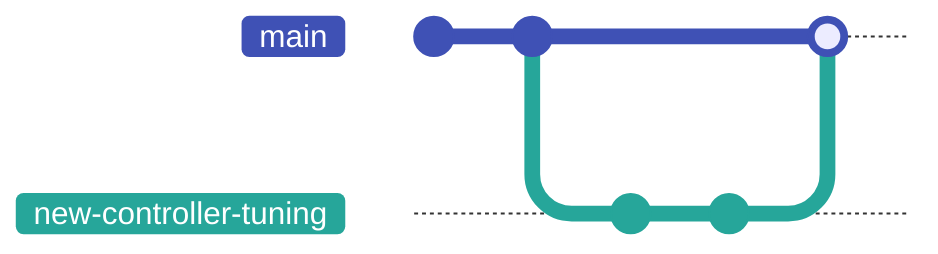

# Version Control with Git

Version control is the system that lets you take **snapshots** of your project as it evolves: every time you reach a working state, you save it. If you break something later, you can return to the snapshot. If you work with others, version control coordinates everyone's changes so they do not overwrite each other.

The tool you will use for this — in this course, in your degree, and in industry — is **Git**.

This chapter introduces the concepts, then walks through the commands you need on day one.

---

## The concepts

A **repository** (or "repo") is your project plus its complete history of changes. It lives in a `.git/` folder at the root of the project; you never look inside it directly. The repo is a self-contained timeline.

A **commit** is one snapshot. Each commit records:

- the full state of the project at that moment (git stores the complete snapshot, not a list of edits — the "what changed" you see in `git diff` is worked out on demand by comparing two snapshots),
- a message describing the change (written by you),
- a unique identifier (a 40-character hash),
- the commit that came before it (its "parent").

A **branch** is a line of development. The first branch is conventionally called `main`, though a plain `git init` still names it `master` unless you have told git otherwise — run `git config --global init.defaultBranch main` once and every new repo starts on `main`. You can create new branches to work on a feature without disturbing `main`, then merge your work back when it is ready.

A **remote** is a copy of your repo on another machine (usually GitHub). You **push** your commits up to the remote to share them; you **pull** to get commits others have pushed.

That is the whole model. Repo, commits, branches, remotes.

---

## Configuring git (once per machine)

Before your first commit, tell git who you are. This information goes into every commit you make:

```bash
git config --global user.name "Your Name"
git config --global user.email "your.email@stud.ntnu.no"
```

`--global` means "for every git repo on this machine." Set it once, forget it.

---

## A typical first day with a repo

The commands below are the ones you will type ten times a day. Get comfortable with them.

### Starting a new project

```bash
git init                  # turn the current folder into a git repo
git status                # see what git thinks the state is
```

### Saving your work (a commit)

```bash
git add CMakeLists.txt main.cpp     # stage these files for the next commit
git status                          # check what is staged
git commit -m "Initial Hello World" # record a snapshot with a message
```

`git add` does *not* save anything yet; it just marks files for inclusion. `git commit` is the snapshot. The `-m` flag attaches a short message.

> Write commit messages that explain *why* you made the change, not just *what* changed. "Fix off-by-one in motor PID loop" is far more useful three months later than "fix bug" or "update file."

To see the history:

```bash
git log
git log --oneline    # compact view
```

### Working with a remote (GitHub)

There are two ways your local repo and a GitHub repo first meet.

**If the project already lives on GitHub**, clone it:

```bash
git clone https://github.com/owner/repo.git   # download the repo from GitHub
cd repo
# make changes, git add, git commit ...
git push                                   # send your commits back to GitHub
git pull                                   # fetch and merge others' commits
```

**If you started locally** with `git init` (the flow above) and now want it on GitHub, create an empty repository on GitHub, then connect and push:

```bash
git remote add origin https://github.com/owner/repo.git   # name the remote "origin"
git push -u origin main                                    # push main and remember the link
```

`git remote add origin <url>` tells your local repo where its GitHub copy lives (`origin` is the conventional name for it). The `-u` on that first push sets `main` to track `origin/main`, so from then on a plain `git push` and `git pull` know where to go. The first push asks you to log in to GitHub; your operating system's credential manager saves it so you are not asked again.

Either way, `git clone` or the `remote add` + first push is what you run *once* to start; `push` and `pull` are what you do repeatedly to stay in sync.

---

## Branching

When you start a new feature or experiment, do it on a new branch:

```bash
git switch -c new-controller-tuning   # create + switch to a new branch
# ... make commits ...
git switch main                       # go back to main
git merge new-controller-tuning       # bring the branch's commits into main
```

That sequence looks like this — work forks off `main`, gathers its own commits, then merges back:



(`git switch` is the modern, clearer command. The older `git checkout` does the same thing and you will see it in tutorials.)

If you regret a branch, just throw it away:

```bash
git switch main
git branch -D new-controller-tuning
```

Branches are cheap. Make one for every feature, experiment, or attempt.

!!! note "When merge says `CONFLICT`"
    If two branches changed the same lines, `git merge` stops and reports a **conflict**. Git marks the clash inside the file with three lines of markers:

    ```
    <<<<<<< HEAD
    your version of the lines
    =======
    the other branch's version
    >>>>>>> new-controller-tuning
    ```

    Open the file, delete the markers, and leave the text you want (yours, theirs, or a blend of both). Then `git add <file>` to mark it resolved and `git commit` to finish the merge. `git status` lists every file still in conflict.

---

## Pull requests

A **pull request** (PR, sometimes "merge request") is GitHub's way of asking "please review and merge my branch into main." You push your branch to GitHub, click "Create pull request," and your teammates can read the change, comment, and approve before the merge happens.

You will not always use PRs on solo projects. You will use them constantly in any team setting and in this course's group work. The mechanics:

1. Create a branch, commit your changes, and push the branch to GitHub. A brand-new branch has no remote counterpart yet, so the first push must name one: `git push -u origin new-controller-tuning`. (A bare `git push` fails here with *"no upstream branch"* — the `-u` creates the upstream and remembers it, so later pushes on this branch are just `git push`.)
2. Open a pull request from that branch to `main`.
3. Wait for review; address feedback by pushing additional commits to the same branch.
4. Once approved, merge the PR.

---

## Common commands at a glance

| Command | Purpose |
|---------|---------|
| `git init` | Create a new repo in the current folder |
| `git clone <url>` | Download an existing repo |
| `git status` | What has changed; what is staged |
| `git add <file>` | Stage a file for the next commit |
| `git commit -m "..."` | Record the staged changes as a snapshot |
| `git log` | Show commit history |
| `git diff` | Show unstaged changes |
| `git diff --staged` | Show staged but uncommitted changes |
| `git push` | Send commits to the remote |
| `git pull` | Fetch and merge commits from the remote |
| `git switch -c <name>` | Create and switch to a new branch |
| `git switch <name>` | Switch to an existing branch |
| `git merge <branch>` | Merge another branch into the current one |
| `git branch` | List branches |

---

## When something goes wrong

Three situations every student hits in their first month.

**"I changed a file but I didn't mean to."**

```bash
git restore path/to/file       # discard unsaved changes to that file
```

!!! warning "This one *does* delete"
    `git restore` throws away your uncommitted changes to that file for good — they were never committed, so there is no snapshot to recover them from. This is the exception to "almost nothing is truly deleted" below: that safety net only covers work you have already committed. Be sure you want the changes gone before you run it.

**"I staged a file but I didn't mean to."**

```bash
git restore --staged path/to/file
```

**"My last commit had a typo in the message."**

```bash
git commit --amend -m "corrected message"
```

(Only amend a commit you have not yet pushed. Once it is shared, leave it alone.)

For everything else (merge conflicts, lost work, "what happened?") the answer is almost always:

```bash
git status     # what git thinks the state is
git log        # what happened recently
```

Git is forgiving by default. Almost nothing is truly deleted until you explicitly run a destructive command.

---

## What to put in `.gitignore`

A `.gitignore` file lists files and folders that git should never track. For a typical CMake project:

```
build/
.vs/
.idea/
cmake-build-debug/
cmake-build-release/
*.exe
*.o
*.obj
```

Never commit build outputs, IDE settings, or credentials. The repo should contain only source — what you wrote and need to share.

---

## Further reading

Git has more depth than fits in one chapter. The single best free resource is the official Git Book ([git-scm.com/book](https://git-scm.com/book/en/v2)); chapters 2 and 3 cover the day-to-day workflow in detail.

- [Official Git tutorial](https://git-scm.com/docs/gittutorial)
- ["Become a Git Guru" by Atlassian](https://www.atlassian.com/git/tutorials)
- [Working with Git in CLion](https://www.jetbrains.com/help/clion/working-with-git-tutorial.html)

---

## Summary

- A repo is a project plus its history. A commit is one snapshot.
- Stage with `git add`, save with `git commit`, share with `git push`, sync with `git pull`.
- Use branches for everything; they are free.
- Write commit messages that explain *why*, not just *what*.
- When in doubt: `git status`, `git log`.
