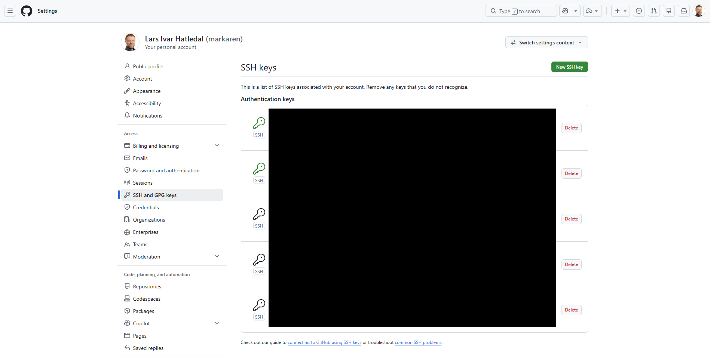
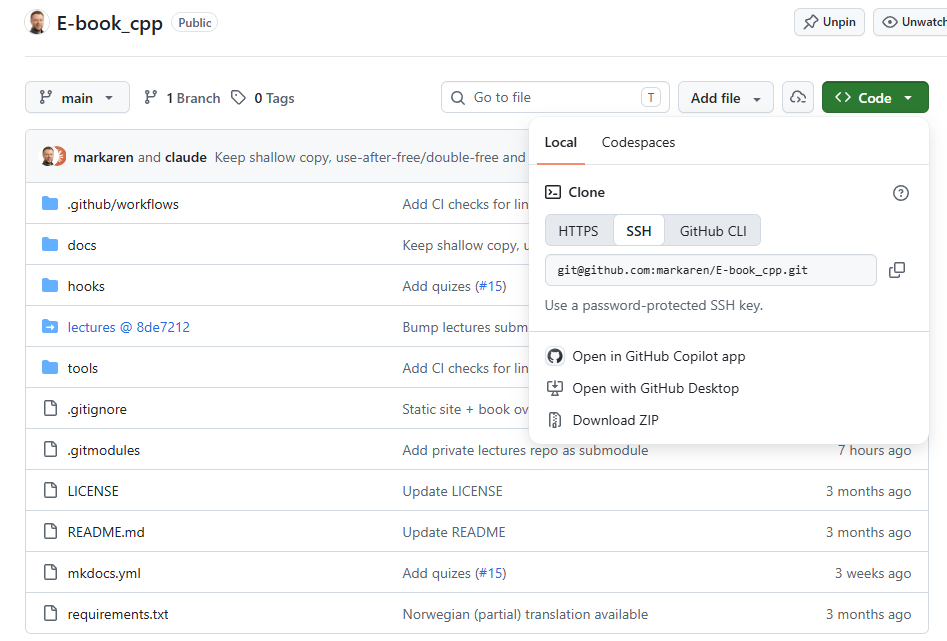
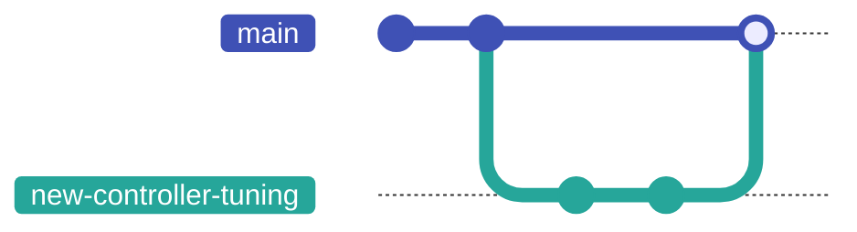
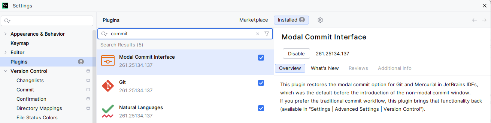

# Versjonskontroll med Git

Versjonskontroll er systemet som lar deg ta **øyeblikksbilder** av prosjektet ditt etter hvert som det utvikler seg: hver gang du når en fungerende tilstand, lagrer du den. Hvis du ødelegger noe senere, kan du gå tilbake til øyeblikksbildet. Hvis du jobber med andre, koordinerer versjonskontrollen alles endringer slik at de ikke overskriver hverandre.

Verktøyet du kommer til å bruke til dette — i dette emnet, i graden din og i industrien — er **Git**.

Dette kapittelet introduserer begrepene, går gjennom kommandoene du trenger fra dag én, og viser deretter hvor de samme operasjonene bor i CLion — som er der du kommer til å gjøre mesteparten av det daglige git-arbeidet ditt.

---

## Begrepene {#the-concepts}

Et **repository** (eller "repo") er prosjektet ditt pluss hele historikken av endringer. Det bor i en `.git/`-mappe i roten av prosjektet; du ser aldri inn i den direkte. Repoet er en selvstendig tidslinje.

En **commit** er ett øyeblikksbilde. Hver commit registrerer:

- hele tilstanden til prosjektet i det øyeblikket (git lagrer det komplette øyeblikksbildet, ikke en liste over redigeringer — det "hva som endret seg" du ser i `git diff`, regnes ut på forespørsel ved å sammenligne to øyeblikksbilder),
- en melding som beskriver endringen (skrevet av deg),
- en unik identifikator (en hash på 40 tegn),
- commiten som kom før den ("forelderen" dens).

En **branch** er en utviklingslinje. Den første branchen kalles etter konvensjon `main`, men en ren `git init` kaller den fortsatt `master` med mindre du har fortalt git noe annet — kjør `git config --global init.defaultBranch main` én gang, så starter hvert nytt repo på `main`. Du kan opprette nye brancher for å jobbe med en funksjon uten å forstyrre `main`, og så merge arbeidet ditt tilbake når det er klart.

En **remote** er en kopi av repoet ditt på en annen maskin (vanligvis GitHub). Du **pusher** commitene dine opp til remoten for å dele dem; du **puller** for å hente commiter andre har pushet.

Det er hele modellen. Repo, commit, branch, remote.

---

## Konfigurere git (én gang per maskin) {#configuring-git-once-per-machine}

Før din første commit, fortell git hvem du er. Denne informasjonen går inn i hver commit du lager:

```bash
git config --global user.name "Your Name"
git config --global user.email "your.email@stud.ntnu.no"
```

`--global` betyr "for hvert git-repo på denne maskinen." Sett det én gang, glem det.

---

## En typisk første dag med et repo {#a-typical-first-day-with-a-repo}

Kommandoene nedenfor er de du kommer til å skrive ti ganger om dagen. Bli komfortabel med dem.

### Starte et nytt prosjekt {#starting-a-new-project}

```bash
git init                  # gjør gjeldende mappe om til et git-repo
git status                # se hva git mener tilstanden er
```

### Lagre arbeidet ditt (en commit) {#saving-your-work-a-commit}

```bash
git add CMakeLists.txt main.cpp     # stage disse filene for neste commit
git status                          # sjekk hva som er staget
git commit -m "Initial Hello World" # registrer et øyeblikksbilde med en melding
```

`git add` lagrer *ikke* noe ennå; den bare markerer filer for å bli med. `git commit` er øyeblikksbildet. `-m`-flagget legger ved en kort melding.

> Skriv commit-meldinger som forklarer *hvorfor* du gjorde endringen, ikke bare *hva* som endret seg. "Fix off-by-one in motor PID loop" er langt mer nyttig tre måneder senere enn "fix bug" eller "update file".

For å se historikken:

```bash
git log
git log --oneline    # kompakt visning
```

### Jobbe med en remote (GitHub) {#working-with-a-remote-github}

Som remote kommer du til å bruke **GitHub** — i dette emnet og, mest sannsynlig, resten av karrieren din. Hvis du ikke har en konto ennå, registrer deg på [github.com](https://github.com) (hvilken som helst e-postadresse fungerer; du kan legge til NTNU-adressen din senere for studentfordeler).

#### Sett opp SSH-tilgang (én gang per maskin) {#set-up-ssh-access-once-per-machine}

Når datamaskinen din snakker med GitHub, må den bevise hvem du er. I dette emnet bruker vi **SSH-nøkler** til det: et nøkkelpar bestående av to filer — en *privat* nøkkel som aldri forlater maskinen din, og en *offentlig* nøkkel du gir til GitHub. Sett det opp én gang, og hver clone, push og pull etterpå bare virker, uten passord eller innloggingsdialoger, i terminalen så vel som i CLion. Oppsettet er fire korte steg; gjør dem rolig og i rekkefølge.

**1. Generer nøkkelparet.** Åpne en terminal (på Windows: PowerShell — eller **Terminal**-fanen nederst i CLion) og kjør:

```bash
ssh-keygen -t ed25519 -C "your.email@stud.ntnu.no"
```

Den spør hvor nøkkelen skal lagres, og om en passfrase — trykk **Enter** på hvert spørsmål for å godta standardvalgene. Dette lager to filer i den skjulte `.ssh`-mappen i hjemmemappen din:

- `id_ed25519` — den **private** nøkkelen. Aldri del den, aldri commit den, aldri lim den inn noe sted.
- `id_ed25519.pub` — den **offentlige** nøkkelen. Det er denne GitHub får (`.pub` som i *public*).

**2. Kopier den offentlige nøkkelen.** Legg innholdet i `.pub`-filen på utklippstavlen:

=== "Windows (PowerShell)"

    ```bash
    Get-Content ~\.ssh\id_ed25519.pub | clip
    ```

=== "macOS"

    ```bash
    pbcopy < ~/.ssh/id_ed25519.pub
    ```

=== "Linux"

    ```bash
    cat ~/.ssh/id_ed25519.pub
    ```

    Marker så linjen som skrives ut, og kopier den.

**3. Gi den til GitHub.** På github.com, klikk profilbildet ditt (øverst til høyre) → **Settings** → **SSH and GPG keys** → **New SSH key**. Lim nøkkelen inn i *Key*-feltet, gi den en tittel som "NTNU-laptop", og klikk **Add SSH key**.

{ .screenshot }

**4. Test det.** Tilbake i terminalen:

```bash
ssh -T git@github.com
```

Aller første gang spør SSH om den skal stole på GitHub (*"The authenticity of host 'github.com' can't be established"*) — skriv `yes` og trykk **Enter**. Suksess ser slik ut:

```
Hi yourusername! You've successfully authenticated, but GitHub does not provide shell access.
```

Den siste delen er normal — den betyr at alt virker.

!!! warning "De to feilene alle gjør"
    - **Å lime inn feil nøkkel.** GitHub får `.pub`-filen, ingenting annet. Hvis GitHub avviser nøkkelen eller en rød advarsel dukker opp, sjekk at du ikke limte inn den private nøkkelen.
    - **`Permission denied (publickey)`.** Denne feilen, ved clone eller push, betyr at GitHub ikke har nøkkelen din: enten ble steg 3 hoppet over, eller du er på en annen maskin enn den som genererte nøkkelen. Hver maskin du jobber på, trenger sin egen runde gjennom disse stegene.

Fra nå av, hver gang du kopierer et repos adresse fra GitHubs grønne **Code**-knapp, bruk **SSH**-fanen — URL-en ser ut som `git@github.com:owner/repo.git`. (Du vil også se **HTTPS**-URL-er, `https://github.com/...`; de virker også, med en nettleserinnlogging i stedet for en nøkkel, men i dette emnet standardiserer vi på SSH.)

{ .screenshot }

Det er to måter ditt lokale repo og et GitHub-repo først møtes på.

**Hvis prosjektet allerede bor på GitHub**, klon det:

```bash
git clone git@github.com:owner/repo.git   # last ned repoet fra GitHub
cd repo
# gjør endringer, git add, git commit ...
git push                                   # send commitene dine tilbake til GitHub
git pull                                   # hent og merge andres commiter
```

**Hvis du startet lokalt** med `git init` (flyten ovenfor) og nå vil ha det på GitHub, opprett et tomt repository på GitHub, og koble så til og push:

```bash
git remote add origin git@github.com:owner/repo.git   # gi remoten navnet "origin"
git push -u origin main                                # push main og husk koblingen
```

`git remote add origin <url>` forteller det lokale repoet ditt hvor GitHub-kopien dets bor (`origin` er det konvensjonelle navnet på den). `-u`-en på den første pushen setter `main` til å spore `origin/main`, så fra da av vet en ren `git push` og `git pull` hvor de skal. Fordi SSH-nøkkelen din allerede beviser hvem du er, går pushen gjennom uten noen innloggingsdialog.

Uansett vei: `git clone`, eller `remote add` + første push, er det du kjører *én gang* for å starte; `push` og `pull` er det du gjør gjentatte ganger for å holde deg synkronisert.

---

## Branching {#branching}

Når du starter en ny funksjon eller et eksperiment, gjør det på en ny branch:

```bash
git switch -c new-controller-tuning   # opprett + bytt til en ny branch
# ... gjør commiter ...
git switch main                       # gå tilbake til main
git merge new-controller-tuning       # ta branchens commiter inn i main
```

Den sekvensen ser slik ut — arbeidet forgrener seg fra `main`, samler sine egne commiter, og merges så tilbake:



(`git switch` er den moderne, klarere kommandoen. Den eldre `git checkout` gjør det samme, og du kommer til å se den i veiledninger.)

Hvis du angrer på en branch, bare kast den:

```bash
git switch main
git branch -D new-controller-tuning
```

Brancher er billige. Lag én for hver funksjon, hvert eksperiment og hvert forsøk.

!!! note "Når merge sier `CONFLICT`"
    Hvis to brancher endret de samme linjene, stopper `git merge` og rapporterer en **konflikt**. Git markerer kollisjonen inne i filen med tre linjer med markører:

    ```
    <<<<<<< HEAD
    din versjon av linjene
    =======
    den andre branchens versjon
    >>>>>>> new-controller-tuning
    ```

    Åpne filen, slett markørene, og la teksten du vil ha, stå igjen (din, deres, eller en blanding av begge). Kjør så `git add <file>` for å markere den som løst, og `git commit` for å fullføre mergen. `git status` lister hver fil som fortsatt er i konflikt.

---

## Pull requests {#pull-requests}

En **pull request** (PR, noen ganger "merge request") er GitHubs måte å spørre "vær så snill, se over og merge branchen min inn i main" på. Du pusher branchen din til GitHub, klikker "Create pull request", og lagkameratene dine kan lese endringen, kommentere og godkjenne før mergen skjer.

Du kommer ikke alltid til å bruke PR-er på soloprosjekter. Du kommer til å bruke dem konstant i enhver teamsammenheng og i gruppearbeidet i dette emnet. Mekanikken:

1. Opprett en branch, commit endringene dine, og push branchen til GitHub. En splitter ny branch har ingen motpart på remoten ennå, så den første pushen må navngi én: `git push -u origin new-controller-tuning`. (En ren `git push` feiler her med *"no upstream branch"* — `-u`-en oppretter upstreamen og husker den, så senere pusher på denne branchen er bare `git push`.)
2. Åpne en pull request fra den branchen til `main`. Den enkleste måten: rett etter at du har pushet, åpne repoet på github.com — et gult banner med en **Compare & pull request**-knapp dukker opp. Klikk den, skriv en kort beskrivelse av endringen, og klikk **Create pull request**.
3. Vent på gjennomgang; svar på tilbakemeldinger ved å pushe flere commiter til den samme branchen.
4. Når den er godkjent, merge PR-en.

---

## Git i CLion {#git-in-clion}

Alt ovenfor virker i enhver terminal, og du bør kunne gjøre det der — når git oppfører seg rart, er terminalen stedet du finner ut hva som faktisk foregår. Til daglig kommer du likevel mest til å bruke git gjennom **CLion**, som har hver operasjon fra dette kapittelet innebygd i grensesnittet sitt. Ingenting nytt å lære: CLion kjører nøyaktig de samme git-kommandoene for deg, og vokabularet — commit, push, pull, branch — er identisk.

### Koble CLion til GitHub (én gang) {#connect-clion-to-github-once}

1. Åpne **File → Settings → Version Control → GitHub** (på macOS: **CLion → Settings**).
2. Klikk **+** og velg **Log In via GitHub**.
3. Nettleseren din åpnes; logg inn på GitHub og klikk **Authorize**.
4. Tilbake på den samme innstillingssiden, kryss av **Clone git repositories using ssh**, og klikk **OK**.

<!-- skjermbilde: CLion Settings → Version Control → GitHub med en konto lagt til og "Clone git repositories using ssh" avkrysset -->

Det er hele oppsettet. Innloggingen lar CLion liste repoene dine og opprette pull requests for deg; avkrysningsboksen får den til å bruke SSH-nøkkelen du satte opp tidligere, for hver clone, push og pull — den samme nøkkelen, enten du jobber i CLion eller i terminalen.

### Installer plugin-en Modal Commit Interface (én gang) {#install-the-modal-commit-interface-plugin-once}

Nyere CLion-versjoner committer gjennom et *ikke-modalt* **Commit**-verktøyvindu forankret i sidefeltet. Dette emnet bruker i stedet den eldre **modale** commit-dialogen: ett samlet vindu med fillisten, diffen og meldingen på samme sted, slik at en commit blir én bevisst handling i stedet for noe spredt utover editoren. Den er en plugin nå, og verdt å installere med en gang:

1. Åpne **File → Settings → Plugins**, velg fanen **Marketplace**, og søk etter `commit`.
2. Installer **Modal Commit Interface**, og start CLion på nytt når den ber om det.
3. Skru på det modale grensesnittet under **File → Settings → Advanced Settings → Version Control**.

{ .screenshot }

Fra da av åpner **Ctrl+K** (**⌘K** på macOS) commit-dialogen, og resten av dette kapittelet forutsetter den. Hopper du over plugin-en, virker alt nedenfor fortsatt — det skjer bare i det forankrede verktøyvinduet i stedet.

### Hente et prosjekt {#getting-a-project}

- **Klone fra GitHub:** på velkomstskjermen, velg **Clone Repository** (eller **File → New → Project from Version Control** med et prosjekt åpent). Siden du er logget inn, lister CLion dine egne GitHub-repoer å velge fra; for et hvilket som helst annet repo, lim inn SSH-URL-en dets.
- **Legge et lokalt prosjekt på GitHub:** med prosjektet åpent, velg **Git → GitHub → Share Project on GitHub**, gi det et navn, og klikk **Share**. CLion oppretter repositoryet på GitHub og pusher koden din i ett steg — dette erstatter hele `git remote add` + `git push -u origin main`-sekvensen fra tidligere.

<!-- skjermbilde: CLions "Share Project on GitHub"-dialog -->

### Den daglige syklusen {#the-daily-cycle}

- **Commit:** trykk **Ctrl+K** (**⌘K** på macOS) for å åpne commit-dialogen. Å krysse av en fils avkrysningsboks er `git add`; klikk en fil for å se nøyaktig hva som endret seg i den. Skriv en melding og trykk **Commit** — eller **Commit and Push...** for å dele den i samme steg.
- **Push:** **Git → Push** (**Ctrl+Shift+K**).
- **Pull:** **Git → Update Project** (**Ctrl+T**).
- **Brancher:** klikk branch-navnet i verktøylinjen (eller i statuslinjen nederst til høyre). Derfra kan du opprette en **New Branch** eller bytte til en eksisterende — CLions versjon av `git switch`.
- **Historikk:** **Git**-verktøyvinduets **Log**-fane er en klikkbar `git log`, som viser commit-grafen med hver branch.

| Terminal | I CLion |
|---------|----------|
| `git clone <url>` | Velkomstskjermen → **Clone Repository** |
| `git add` + `git commit` | Commit-dialogen (**Ctrl+K**): kryss av filer, skriv melding, **Commit** |
| `git push` | **Git → Push** |
| `git pull` | **Git → Update Project** |
| `git switch -c <name>` | Branch-navnet i verktøylinjen → **New Branch** |
| `git merge <branch>` | Branch-navnet i verktøylinjen → velg branch → **Merge into Current** |
| `git log` | **Git**-verktøyvinduet → **Log**-fanen |
| `git diff` | Klikk en fil i commit-dialogen |

### "Add file to Git?" {#add-file-to-git}

Når du oppretter en ny fil, spør CLion om den skal legges til i git. Si **Add** for alt du har skrevet — kildefiler, `CMakeLists.txt`, headere. Si **Cancel** for genererte filer; enda bedre, hold en ordentlig `.gitignore` (se nedenfor), så slutter CLion å spørre om dem i det hele tatt.

### Merge-konflikter, den komfortable måten {#merge-conflicts-the-comfortable-way}

Når en merge treffer en konflikt, åpner CLion en **Conflicts**-dialog som lister de berørte filene. Klikk **Merge** på en fil, og du får en treveisvisning: din versjon til venstre, den innkommende versjonen til høyre, og resultatet du bygger i midten. Godta en sides endring med **>>**/**<<**-pilene, forkast én med **×**, eller rediger midtruten direkte, og klikk så **Apply**. Det er den samme konfliktløsningen som å redigere `<<<<<<<`-markørene for hånd — bare langt vanskeligere å gjøre feil.

!!! tip "Når GUI-et forvirrer deg"
    CLion har en **Terminal**-fane nederst. Uansett hvilken tilstand knappene har fått deg inn i, forteller `git status` der deg sannheten, i de samme begrepene som dette kapittelet.

---

## Vanlige kommandoer på ett brett {#common-commands-at-a-glance}

| Kommando | Formål |
|---------|---------|
| `git init` | Opprett et nytt repo i gjeldende mappe |
| `git clone <url>` | Last ned et eksisterende repo |
| `git status` | Hva som er endret; hva som er staget |
| `git add <file>` | Stage en fil for neste commit |
| `git commit -m "..."` | Registrer de stagede endringene som et øyeblikksbilde |
| `git log` | Vis commit-historikken |
| `git diff` | Vis endringer som ikke er staget |
| `git diff --staged` | Vis stagede, men ennå ikke committede endringer |
| `git push` | Send commiter til remoten |
| `git pull` | Hent og merge commiter fra remoten |
| `git switch -c <name>` | Opprett og bytt til en ny branch |
| `git switch <name>` | Bytt til en eksisterende branch |
| `git merge <branch>` | Merge en annen branch inn i den gjeldende |
| `git branch` | List brancher |

---

## Når noe går galt {#when-something-goes-wrong}

Tre situasjoner hver student møter i løpet av sin første måned.

**"Jeg endret en fil, men jeg mente det ikke."**

```bash
git restore path/to/file       # forkast ulagrede endringer i den filen
```

!!! warning "Denne *sletter* faktisk"
    `git restore` kaster de ikke-committede endringene dine i den filen for godt — de ble aldri committet, så det finnes ikke noe øyeblikksbilde å hente dem tilbake fra. Dette er unntaket fra "nesten ingenting er virkelig slettet" nedenfor: det sikkerhetsnettet dekker bare arbeid du allerede har committet. Vær sikker på at du vil ha endringene vekk før du kjører den.

**"Jeg staget en fil, men jeg mente det ikke."**

```bash
git restore --staged path/to/file
```

**"Min siste commit hadde en skrivefeil i meldingen."**

```bash
git commit --amend -m "corrected message"
```

(Bare amend en commit du ennå ikke har pushet. Når den først er delt, la den være i fred.)

For alt annet (merge-konflikter, tapt arbeid, "hva skjedde?") er svaret nesten alltid:

```bash
git status     # hva git mener tilstanden er
git log        # hva som skjedde nylig
```

Git er tilgivende som standard. Nesten ingenting er virkelig slettet før du eksplisitt kjører en destruktiv kommando.

---

## Hva du skal legge i `.gitignore` {#what-to-put-in-gitignore}

En `.gitignore`-fil lister filer og mapper som git aldri skal spore. For et typisk CMake-prosjekt:

```
build/
.vs/
.idea/
cmake-build-debug/
cmake-build-release/
*.exe
*.o
*.obj
```

Aldri commit byggeresultater, IDE-innstillinger eller påloggingsinformasjon. Repoet skal bare inneholde kildekode — det du skrev og trenger å dele.

---

## Videre lesning {#further-reading}

Git har mer dybde enn det som får plass i ett kapittel. Den beste enkeltstående gratisressursen er den offisielle Git-boken ([git-scm.com/book](https://git-scm.com/book/en/v2)); kapittel 2 og 3 dekker den daglige arbeidsflyten i detalj.

- [Offisiell Git-veiledning](https://git-scm.com/docs/gittutorial)
- ["Become a Git Guru" av Atlassian](https://www.atlassian.com/git/tutorials)
- [Jobbe med Git i CLion](https://www.jetbrains.com/help/clion/working-with-git-tutorial.html)

---

## Oppsummering {#summary}

- Et repo er et prosjekt pluss historikken dets. En commit er ett øyeblikksbilde.
- Stage med `git add`, lagre med `git commit`, del med `git push`, synkroniser med `git pull`.
- Bruk brancher til alt; de er gratis.
- Skriv commit-meldinger som forklarer *hvorfor*, ikke bare *hva*.
- Sett opp SSH-nøkkelen din én gang per maskin og gi `.pub`-filen til GitHub; etter det bare virker hver push og pull, i terminalen og i CLion.
- CLion har alt dette innebygd: logg inn på GitHub én gang, og commit, push, pull og branch deretter fra IDE-en.
- Når du er i tvil: `git status`, `git log`.
