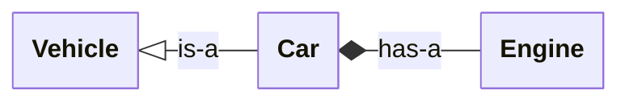
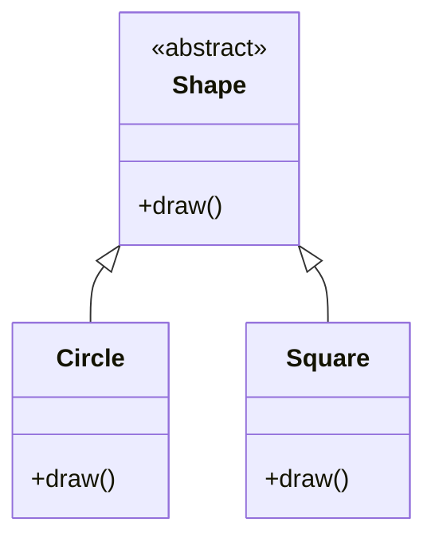

# Polymorphism

**Polymorphism** ("many forms") is the ability to treat different concrete types through a common interface. Code written against the common interface does not need to know which specific type it is dealing with.

This is the feature that lets you swap one implementation for another without touching the code that uses it: replace a console logger with a file logger, swap a real sensor for a simulated one in tests, add a new shape to a drawing program without rewriting the renderer.

C++ has two kinds:

| Kind | Resolved at | Mechanism |
|------|-------------|-----------|
| Compile-time polymorphism | Compile time | Function overloading, templates |
| Runtime polymorphism | Run time | Virtual functions through inheritance |

Compile-time polymorphism is faster (no indirection at runtime) but every concrete type must be known when the code is built. Runtime polymorphism is slightly slower but allows behaviour to be selected (or even loaded) after the program has started.

---

## A motivating example

Suppose your simulation needs to log progress. Sometimes you want output on the console; sometimes to a file; in tests you want it suppressed entirely. You could pepper your code with `if` statements:

```cpp
if (logToFile) {
    file << message << "\n";
} else if (logToConsole) {
    std::cout << message << "\n";
}
```

This is ugly, and every new destination means changing every call site. Polymorphism solves it cleanly:

```cpp
class Logger {
public:
    virtual ~Logger() = default;
    virtual void log(const std::string& message) = 0;
};
```

`Logger` is an **abstract base class**. The `= 0` marks `log` as a **pure virtual function**, meaning derived classes are required to provide their own implementation. You cannot create a `Logger` directly; you create something that *is* a `Logger`.

```cpp
class ConsoleLogger : public Logger {
public:
    void log(const std::string& message) override {
        std::cout << message << "\n";
    }
};

class FileLogger : public Logger {
public:
    explicit FileLogger(const std::filesystem::path& path) : out_(path) {}

    void log(const std::string& message) override {
        out_ << message << "\n";
    }

private:
    std::ofstream out_;
};
```

Any code that works against `Logger&` or `std::unique_ptr<Logger>` now works with both implementations, and with any future implementation you add:

<!-- no-ce -->
```cpp
class Simulation {
public:
    void setLogger(std::unique_ptr<Logger> logger) {
        logger_ = std::move(logger);
    }

    void step(double dt) {
        // ... do work ...
        if (logger_) {
            logger_->log(std::format("Step t={}", t_));
        }
        t_ += dt;
    }

private:
    double t_ = 0;
    std::unique_ptr<Logger> logger_;
};

int main() {
    Simulation sim;
    sim.setLogger(std::make_unique<FileLogger>("simulation.log"));
    // or:
    // sim.setLogger(std::make_unique<ConsoleLogger>());

    sim.step(0.1);
}
```

`Simulation` knows nothing about files or terminals. To add a `NetworkLogger` later you write the class. That is it. No change to `Simulation`.

The rest of this chapter explains how every piece of that example works.

---

## Inheritance

A **derived class** is built on top of a **base class**, automatically getting all of its members:

```cpp
class Vehicle {
public:
    void start() { std::cout << "Engine starting\n"; }
};

class Car : public Vehicle {
public:
    void honk() { std::cout << "Beep!\n"; }
};

Car c;
c.start();   // inherited from Vehicle
c.honk();    // defined on Car
```

The `public` after the colon is the **access specifier**. For 99% of cases (including everything in this course) you want `public` inheritance. `private` and `protected` inheritance exist but are rare and surprising.

Inheritance models the "**is-a**" relationship: a `Car` *is a* `Vehicle`. If you find yourself reaching for inheritance to model "**has-a**" (a `Car` *has an* engine), use a member variable instead.



---

## Virtual functions

A regular function call is resolved based on the *static* type of the variable. A `virtual` function call is resolved based on the *dynamic* type of the object: the actual type at runtime.

```cpp
class Shape {
public:
    virtual ~Shape() = default;
    virtual void draw() = 0;
};

class Circle : public Shape {
public:
    void draw() override { std::cout << "Drawing a circle\n"; }
};

class Square : public Shape {
public:
    void draw() override { std::cout << "Drawing a square\n"; }
};

void render(Shape& shape) {
    shape.draw();    // calls Circle::draw() or Square::draw(), depending on actual type
}
```

One base interface, several concrete types — the shape of every runtime-polymorphic hierarchy:



`override` is not strictly required, but always write it. It tells the compiler "I mean to be overriding a base-class function." If you mistype the name, change a parameter type, or get the const-ness wrong, the compiler will reject the file rather than silently introducing a brand-new unrelated function.

### Pure virtual = abstract

A function written `= 0` is **pure virtual**:

```cpp
class Shape {
public:
    virtual void draw() = 0;   // pure virtual
};
```

A class with at least one pure virtual function is **abstract**: you cannot instantiate it directly. Concrete derived classes must implement the function before they can be instantiated. This is how `Logger` enforces "every concrete logger must implement `log`."

---

## The virtual destructor rule

A class designed for polymorphic use (one whose derived objects may be deleted through a base-class pointer) **must** have a virtual destructor:

```cpp
class Logger {
public:
    virtual ~Logger() = default;   // required!
    virtual void log(const std::string&) = 0;
};
```

Without it, deleting a `FileLogger` through a `std::unique_ptr<Logger>` runs only `Logger`'s destructor, never `FileLogger`'s. The open file leaks, derived destructors never run, and you are in undefined-behaviour territory. The compiler does not warn you.

Rule of thumb: every class with any `virtual` function should also have a `virtual` destructor.

---

## Object slicing

`Shape` above is abstract, so the compiler will not even let you copy a `Circle` into a `Shape` *value* — `Shape s = c;` is a compile error. That is the language protecting you.

The trap appears with a **concrete** base class (one you *can* instantiate): copying a derived object into a base value silently drops the derived parts.

```cpp
struct Base {
    virtual ~Base() = default;
    virtual std::string kind() const { return "base"; }
};

struct Derived : Base {
    std::string kind() const override { return "derived"; }
};

Derived d;
Base b = d;             // SLICING: only the Base part is copied
std::cout << b.kind();  // "base" — the Derived-ness is gone
```

A `Derived` object is laid out as a `Base` part plus the fields `Derived` adds. A `Base` *value* has room for only the `Base` part, so the copy keeps that and drops the rest on the floor:

<svg viewBox="0 0 440 168" xmlns="http://www.w3.org/2000/svg" role="img" aria-label="A Derived object holds a Base part and a Derived part. Assigning it to a Base value (Base b = d) copies only the Base part; the Derived part is sliced off and discarded." style="display:block;margin:1rem auto;max-width:440px;width:100%;height:auto;font-family:var(--md-code-font-family,monospace);font-size:13px;" fill="none" stroke="currentColor" stroke-width="1.5">
  <text x="40" y="26" stroke="none" fill="currentColor" font-weight="bold">Derived d;</text>
  <rect x="40" y="44" width="130" height="80" rx="4"/>
  <line x1="40" y1="84" x2="170" y2="84"/>
  <text x="105" y="69" stroke="none" fill="currentColor" text-anchor="middle">Base part</text>
  <text x="105" y="109" stroke="none" fill="currentColor" text-anchor="middle">Derived part</text>
  <text x="40" y="150" stroke="none" fill="currentColor" font-size="11" opacity="0.7">object has both parts</text>
  <text x="270" y="26" stroke="none" fill="currentColor" font-weight="bold">Base b = d;</text>
  <rect x="270" y="44" width="130" height="40" rx="4"/>
  <text x="335" y="69" stroke="none" fill="currentColor" text-anchor="middle">Base part</text>
  <rect x="270" y="92" width="130" height="40" rx="4" stroke-dasharray="4 3" opacity="0.4"/>
  <text x="335" y="117" stroke="none" fill="currentColor" text-anchor="middle" opacity="0.4">Derived part</text>
  <text x="270" y="150" stroke="none" fill="currentColor" font-size="11" opacity="0.7">Derived part sliced off</text>
</svg>

The rule is the same either way: work with polymorphic types through **pointers or references**, never by value:

```cpp
Circle c;
Shape& ref = c;            // OK: reference, no slicing
std::unique_ptr<Shape> p = std::make_unique<Circle>();  // also fine
```

Pass by `Shape&` (or `const Shape&`), store as `std::unique_ptr<Shape>`. Never by `Shape`.

---

## Compile-time polymorphism: overloading

For completeness, the other kind of polymorphism is chosen by the compiler based on argument types, not by the runtime type of the receiver:

### Function overloading

```cpp
void log(int value)            { std::cout << "int: "    << value << "\n"; }
void log(double value)         { std::cout << "double: " << value << "\n"; }
void log(const std::string& s) { std::cout << "str: "    << s     << "\n"; }

log(42);         // calls log(int)
log(3.14);       // calls log(double)
log("hello");    // calls log(const std::string&)
```

### Operator overloading

You can define what the built-in operators (`+`, `-`, `*`, `==`, `<<`, …) mean for your own types:

```cpp
class Complex {
public:
    Complex(int real = 0, int imag = 0) : real_(real), imag_(imag) {}

    Complex operator+(const Complex& other) const {
        return Complex(real_ + other.real_, imag_ + other.imag_);
    }

private:
    int real_, imag_;
};

Complex a(1, 2);
Complex b(3, 4);
Complex sum = a + b;    // calls a.operator+(b)
```

Overload operators when the meaning is obvious. For a `Complex` number, `+` is natural. For an `Employee`, it is not, don't overload it just to be clever.

---

## When to use which

| You want… | Use |
|-----------|-----|
| Different behaviour at runtime, chosen by the actual object type | Virtual functions through inheritance |
| Different behaviour at compile time, chosen by argument types | Overloading or templates |
| One operation conceptually "the same" across types (`add(int)`, `add(double)`) | Overloading |
| Mathematical-style notation on a custom type | Operator overloading |

Inheritance is powerful but expensive in design terms, it ties your derived classes to the base class's contract forever. Reach for it when you have a genuine "is-a" relationship and a clear interface that multiple implementations will share. For everything else, plain functions, composition, and templates are usually cleaner.
