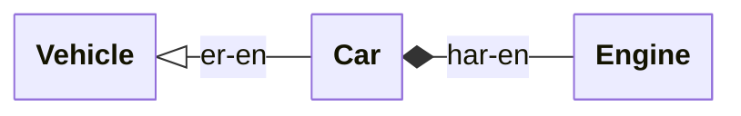
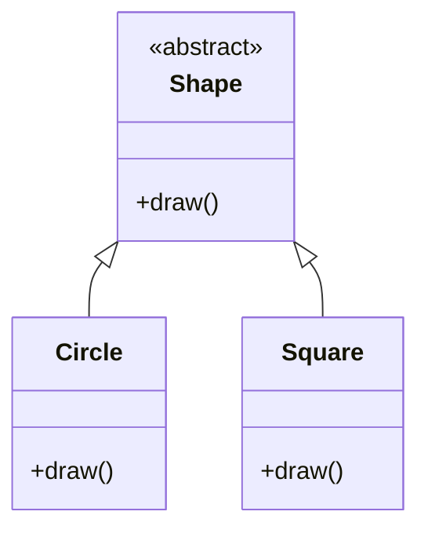

# Polymorfisme

**Polymorfisme** ("mange former") er evnen til å behandle ulike konkrete typer gjennom et felles grensesnitt. Kode skrevet mot det felles grensesnittet trenger ikke vite hvilken spesifikk type den har med å gjøre.

Dette er egenskapen som lar deg bytte ut én implementasjon med en annen uten å røre koden som bruker den: erstatt en konsollogger med en fillogger, bytt en ekte sensor mot en simulert i tester, legg til en ny form i et tegneprogram uten å skrive om rendereren.

C++ har to varianter:

| Variant | Avgjøres | Mekanisme |
|------|-------------|-----------|
| Polymorfisme ved kompilering | Ved kompilering | Funksjonsoverlasting, maler (neste del) |
| Polymorfisme ved kjøring | Ved kjøring | Virtuelle funksjoner gjennom arv |

Polymorfisme ved kompilering er raskere (ingen indireksjon ved kjøring), men hver konkrete type må være kjent når koden bygges. Polymorfisme ved kjøring er litt tregere, men lar oppførsel velges (eller til og med lastes) etter at programmet har startet.

---

## Et motiverende eksempel {#a-motivating-example}

Anta at simuleringen din trenger å logge fremdrift. Noen ganger vil du ha utskrift i konsollen; noen ganger til en fil; i tester vil du undertrykke den helt. Du kunne strødd koden din full av `if`-setninger:

```cpp
if (logToFile) {
    file << message << "\n";
} else if (logToConsole) {
    std::cout << message << "\n";
}
```

Dette er stygt, og hvert nye mål betyr å endre hvert eneste kallsted. Polymorfisme løser det elegant:

```cpp
class Logger {
public:
    virtual ~Logger() = default;
    virtual void log(const std::string& message) = 0;
};
```

`Logger` er en **abstrakt basisklasse**. `= 0` markerer `log` som en **ren virtuell funksjon**, som betyr at avledede klasser er pålagt å levere sin egen implementasjon. Du kan ikke opprette en `Logger` direkte; du oppretter noe som *er* en `Logger`.

```cpp
class ConsoleLogger : public Logger {
public:
    void log(const std::string& message) override {
        std::cout << message << "\n";
    }
};

class FileLogger : public Logger {
public:
    explicit FileLogger(const std::string& path) : out_(path) {}

    void log(const std::string& message) override {
        out_ << message << "\n";
    }

private:
    std::ofstream out_;
};
```

All kode som jobber mot `Logger&` eller `std::unique_ptr<Logger>`, fungerer nå med begge implementasjonene, og med enhver fremtidig implementasjon du legger til:

<!-- no-ce -->
```cpp
class Simulation {
public:
    void setLogger(std::unique_ptr<Logger> logger) {
        logger_ = std::move(logger);
    }

    void step(double dt) {
        // ... gjør arbeid ...
        if (logger_) {
            logger_->log(std::format("Step t={}", t_));
        }
        t_ += dt;
    }

private:
    double t_ = 0;
    std::unique_ptr<Logger> logger_;
};

int main() {
    Simulation sim;
    sim.setLogger(std::make_unique<FileLogger>("simulation.log"));
    // eller:
    // sim.setLogger(std::make_unique<ConsoleLogger>());

    sim.step(0.1);
}
```

`Simulation` vet ingenting om filer eller terminaler. For å legge til en `NetworkLogger` senere skriver du klassen. Det er alt. Ingen endring i `Simulation`.

Resten av dette kapittelet forklarer hvordan hver bit av det eksempelet fungerer.

---

## Arv {#inheritance}

En **avledet klasse** bygges oppå en **basisklasse** og får automatisk alle medlemmene dens:

```cpp
class Vehicle {
public:
    void start() { std::cout << "Engine starting\n"; }
};

class Car : public Vehicle {
public:
    void honk() { std::cout << "Beep!\n"; }
};

Car c;
c.start();   // arvet fra Vehicle
c.honk();    // definert på Car
```

`public` etter kolonet er **tilgangsspesifikatoren**. I 99 % av tilfellene (inkludert alt i dette kurset) vil du ha `public` arv. `private`- og `protected`-arv finnes, men er sjeldne og overraskende.

Arv modellerer "**er-en**"-relasjonen: en `Car` *er en* `Vehicle`. Tar du deg selv i å strekke deg etter arv for å modellere "**har-en**" (en `Car` *har en* motor), bruk en medlemsvariabel i stedet.



### Å konstruere basisdelen {#constructing-the-base}

Et avledet objekt inneholder en basisdel, og den basisdelen må også konstrueres. Når basisklassen har en konstruktør som tar argumenter, **rekker den avledede konstruktøren dem opp** i sin *member initialiser list*, før sine egne medlemmer:

```cpp
class Sensor {
public:
    explicit Sensor(std::string name) : name_(std::move(name)) {}
    const std::string& name() const { return name_; }

private:
    std::string name_;
};

class Thermometer : public Sensor {
public:
    Thermometer(std::string name, double celsius)
        : Sensor(std::move(name)),   // konstruer basisdelen først
          celsius_(celsius) {}       // deretter denne klassens egne medlemmer

private:
    double celsius_;
};
```

`Sensor(std::move(name))` i initialiseringslisten er et kall til basiskonstruktøren. Basisdelen bygges alltid først, deretter de avledede medlemmene, i den rekkefølgen de står.

!!! warning "Har basisklassen ingen standardkonstruktør, *må* du navngi den"

    `Sensor` har ingen standardkonstruktør (dens eneste konstruktør krever et `name`). Så en avledet konstruktør som **ikke** navngir `Sensor` i initialiseringslisten sin, vil ikke kompilere — kompilatoren kan ikke konstruere basisdelen på egen hånd:

    ```cpp
    Thermometer(double celsius) : celsius_(celsius) {}   // feil: Sensor har ingen standardkonstruktør
    ```

    Løsningen er å videresende det basisklassen trenger: `: Sensor(...)`. Hvis basisklassen faktisk *har* en standardkonstruktør, kan du utelate kallet, og den standarden brukes — men å navngi den eksplisitt er aldri feil.

---

## Komposisjon fremfor arv {#composition-over-inheritance}

Arv er ikke den eneste måten å bygge videre på en annen klasse. Du kan i stedet holde en som **medlem** — det er *komposisjon*, "har-en" fra ovenfor. Ofte **kompilerer begge og begge fungerer**, og valget handler om design, ikke korrekthet.

Anta at en `Thermostat` trenger en temperaturavlesning, og du allerede har en `TemperatureSensor`:

```cpp
class TemperatureSensor {
public:
    double readCelsius() const { return 21.5; }   // en ekte ville lest maskinvaren
};
```

Du *kunne* arvet — en termostat rapporterer jo tross alt en temperatur:

```cpp
class Thermostat : public TemperatureSensor {      // "er-en"
public:
    bool shouldHeat(double target) const {
        return readCelsius() < target;             // readCelsius() arvet direkte
    }
};
```

Eller du kunne holdt en som medlem:

```cpp
class Thermostat {                                 // "har-en"
    TemperatureSensor sensor_;
public:
    bool shouldHeat(double target) const {
        return sensor_.readCelsius() < target;
    }
};
```

Begge versjonene kompilerer og oppfører seg identisk — ingen av dem er *feil*. Men medlemsversjonen er det bedre standardvalget, av tre grunner:

- **Den eksponerer bare det du velger.** Gjennom arv blir hver offentlige funksjon i `TemperatureSensor` — og alle den får senere — en del av `Thermostat` sitt grensesnitt også. Med et medlem tilbyr `Thermostat` bare `shouldHeat()`; sensoren er en privat detalj.
- **Den forblir fleksibel.** Trenger du en annen sensor, to av dem, eller en falsk i en [test](../Chapter6/testing.md)? Bytt medlemmet. Arv gifter deg med den ene basisklassen.
- **Den snakker sant.** Offentlig arv lover at en `Thermostat` kan tre inn *hvor som helst* en `TemperatureSensor` forventes ([substituerbarhetstesten](#an-honest-is-a), nedenfor). Men en termostat *bruker* en sensor; den er ikke én. "Har-en" stemmer med virkeligheten; "er-en" gjør det ikke.

Tommelfingerregelen: **arv bare når den avledede typen genuint *er et slag av* basisklassen og du vil ha det delte grensesnittet som får polymorfisme ved kjøring til å fungere (neste del). Når du bare vil gjenbruke det en annen klasse kan, gjør den til et medlem.**

---

## Virtuelle funksjoner {#virtual-functions}

Et vanlig funksjonskall avgjøres ut fra variabelens *statiske* type. Et kall til en `virtual` funksjon avgjøres ut fra objektets *dynamiske* type: den faktiske typen ved kjøring.

```cpp
class Shape {
public:
    virtual ~Shape() = default;
    virtual void draw() = 0;
};

class Circle : public Shape {
public:
    void draw() override { std::cout << "Drawing a circle\n"; }
};

class Square : public Shape {
public:
    void draw() override { std::cout << "Drawing a square\n"; }
};

void render(Shape& shape) {
    shape.draw();    // kaller Circle::draw() eller Square::draw(), avhengig av den faktiske typen
}
```

Ett basisgrensesnitt, flere konkrete typer — formen på ethvert hierarki med polymorfisme ved kjøring:



`override` er strengt tatt ikke påkrevd, men skriv det alltid. Det forteller kompilatoren "jeg har til hensikt å overstyre en funksjon fra basisklassen." Hvis du skriver navnet feil, endrer en parametertype eller bommer på const-heten, vil kompilatoren avvise filen i stedet for i stillhet å innføre en splitter ny, ubeslektet funksjon.

### Å utvide, ikke bare erstatte {#extending-not-just-replacing}

En overstyring trenger ikke kaste basisversjonen på båten. Fra innsiden av en overstyring kan du kalle basisimplementasjonen ved navn med `Base::`, og så legge til:

```cpp
class Logger {
public:
    virtual ~Logger() = default;
    virtual void log(const std::string& message) {
        std::cout << timestamp() << message << "\n";
    }

protected:
    std::string timestamp() const { return "[12:00] "; }   // hjelper for avledede klasser
};

class TaggedLogger : public Logger {
public:
    void log(const std::string& message) override {
        Logger::log("[net] " + message);   // gjenbruk basisoppførselen, med et prefiks lagt til
    }
};
```

`Logger::log(...)` kjører basisversjonen eksplisitt (en ren `log(...)` her ville kalt *denne* klassens versjon igjen — uendelig rekursjon). Merk at `timestamp()` er `protected`: avledede klasser kan bruke den, men kode utenfor kan ikke. Det er den ene hverdagsbruken av `protected` — en hjelper ment for hierarkiet, ikke for det offentlige grensesnittet.

### Ren virtuell = abstrakt {#pure-virtual-abstract}

En funksjon skrevet `= 0` er **ren virtuell**:

```cpp
class Shape {
public:
    virtual void draw() = 0;   // ren virtuell
};
```

En klasse med minst én ren virtuell funksjon er **abstrakt**: du kan ikke instansiere den direkte. Konkrete avledede klasser må implementere funksjonen før de kan instansieres. Det er slik `Logger` håndhever "hver konkrete logger må implementere `log`".

---

## Et ærlig er-en {#an-honest-is-a}

`render` ovenfor tar en `Shape&` og kaller `draw()` på den, i tillit til at *uansett hvilken* form som kommer, oppfører den seg som en `Shape`. Den tilliten er hele grunnlaget for polymorfisme ved kjøring, og den legger en stille forpliktelse på hver klasse du avleder: **en avledet klasse må kunne brukes overalt der basisklassen dens kan, uten å overraske koden som stoler på basisklassen.**

Å erklære at `Circle` *er-en* `Shape` er et løfte, ikke bare syntaks. Hvis `Circle::draw()` gjorde noe annet enn å tegne — kastet et unntak, for eksempel, eller i stillhet gjorde ingenting — ville hver funksjon skrevet mot `Shape&` bryte sammen i det øyeblikket en `Circle` nådde den. Hierarkiet ville kompilert, men det ville løyet.

En avledet klasse holder løftet når den:

- godtar alt basisklassen godtar — den avviser ikke inndata basisklassen ville ha håndtert;
- gjør det basisklassens funksjon er ment å gjøre — ingen kasting der basisklassen ikke ville kastet, ingen ubeslektet oppførsel;
- bevarer det basisklassen garanterer.

Den klassiske fella er en `Square` som arver fra en `Rectangle` med uavhengige `setWidth` og `setHeight`. Et kvadrat må holde sidene sine like, så det kan ikke ærlig tre inn for et rektangel der bredden og høyden beveger seg hver for seg — kode som setter dem separat, bryter sammen. Løsningen er å tenke relasjonen om igjen (et kvadrat og et rektangel er *søsken*, ikke forelder og barn), ikke å tvinge gjennom arven.

> Denne regelen har et formelt navn — **Liskovs substitusjonsprinsipp** — og å etterleve den er det som lar deg stole på en basisklassereferanse uten å kjenne den nøyaktige typen bak.

---

## Regelen om virtuell destruktør {#the-virtual-destructor-rule}

En klasse designet for polymorf bruk (en der avledede objekter kan bli slettet gjennom en peker til basisklassen) **må** ha en virtuell destruktør:

```cpp
class Logger {
public:
    virtual ~Logger() = default;   // påkrevd!
    virtual void log(const std::string&) = 0;
};
```

Uten den kjører sletting av en `FileLogger` gjennom en `std::unique_ptr<Logger>` bare `Logger` sin destruktør, aldri `FileLogger` sin. Den åpne filen lekker, avledede destruktører kjører aldri, og du er i udefinert oppførsel-territorium. Kompilatoren advarer deg ikke.

Tommelfingerregel: hver klasse med en eller annen `virtual` funksjon bør også ha en `virtual` destruktør.

---

## Object slicing {#object-slicing}

`Shape` ovenfor er abstrakt, så kompilatoren lar deg ikke engang kopiere en `Circle` inn i en `Shape`-*verdi* — `Shape s = c;` er en kompileringsfeil. Det er språket som beskytter deg.

Fella dukker opp med en **konkret** basisklasse (en du *kan* instansiere): å kopiere et avledet objekt inn i en basisverdi dropper de avledede delene i stillhet.

```cpp
struct Base {
    virtual ~Base() = default;
    virtual std::string kind() const { return "base"; }
};

struct Derived : Base {
    std::string kind() const override { return "derived"; }
};

Derived d;
Base b = d;             // AVSKJÆRING: bare Base-delen kopieres
std::cout << b.kind();  // "base" — Derived-heten er borte
```

Et `Derived`-objekt er lagt ut som en `Base`-del pluss feltene `Derived` legger til. En `Base`-*verdi* har bare plass til `Base`-delen, så kopien beholder den og slipper resten på gulvet:

<svg viewBox="0 0 440 168" xmlns="http://www.w3.org/2000/svg" role="img" aria-label="Et Derived-objekt består av en Base-del og en Derived-del. Å tilordne det til en Base-verdi (Base b = d) kopierer bare Base-delen; Derived-delen skjæres av og forkastes." style="display:block;margin:1rem auto;max-width:440px;width:100%;height:auto;font-family:var(--md-code-font-family,monospace);font-size:13px;" fill="none" stroke="currentColor" stroke-width="1.5">
  <text x="40" y="26" stroke="none" fill="currentColor" font-weight="bold">Derived d;</text>
  <rect x="40" y="44" width="130" height="80" rx="4"/>
  <line x1="40" y1="84" x2="170" y2="84"/>
  <text x="105" y="69" stroke="none" fill="currentColor" text-anchor="middle">Base-del</text>
  <text x="105" y="109" stroke="none" fill="currentColor" text-anchor="middle">Derived-del</text>
  <text x="40" y="150" stroke="none" fill="currentColor" font-size="11" opacity="0.7">objektet har begge delene</text>
  <text x="270" y="26" stroke="none" fill="currentColor" font-weight="bold">Base b = d;</text>
  <rect x="270" y="44" width="130" height="40" rx="4"/>
  <text x="335" y="69" stroke="none" fill="currentColor" text-anchor="middle">Base-del</text>
  <rect x="270" y="92" width="130" height="40" rx="4" stroke-dasharray="4 3" opacity="0.4"/>
  <text x="335" y="117" stroke="none" fill="currentColor" text-anchor="middle" opacity="0.4">Derived-del</text>
  <text x="270" y="150" stroke="none" fill="currentColor" font-size="11" opacity="0.7">Derived-delen skåret av</text>
</svg>

Regelen er den samme uansett: jobb med polymorfe typer gjennom **pekere eller referanser**, aldri som verdi:

```cpp
Circle c;
Shape& ref = c;            // OK: referanse, ingen slicing
std::unique_ptr<Shape> p = std::make_unique<Circle>();  // også greit
```

Send som `Shape&` (eller `const Shape&`), lagre som `std::unique_ptr<Shape>`. Aldri som `Shape`.

---

## Polymorfisme ved kompilering: overlasting {#compile-time-polymorphism-overloading}

For fullstendighetens skyld: den andre varianten av polymorfisme velges av kompilatoren ut fra argumenttyper, ikke ut fra kjøretidstypen til mottakeren:

### Funksjonsoverlasting {#function-overloading}

```cpp
void log(int value)            { std::cout << "int: "    << value << "\n"; }
void log(double value)         { std::cout << "double: " << value << "\n"; }
void log(const std::string& s) { std::cout << "str: "    << s     << "\n"; }

log(42);         // kaller log(int)
log(3.14);       // kaller log(double)
log("hello");    // kaller log(const std::string&)
```

### Operatoroverlasting {#operator-overloading}

Du kan definere hva de innebygde operatorene (`+`, `-`, `*`, `==`, `<<`, …) betyr for dine egne typer:

```cpp
class Complex {
public:
    Complex(int real = 0, int imag = 0) : real_(real), imag_(imag) {}   // med vilje ikke explicit

    Complex operator+(const Complex& other) const {
        return Complex(real_ + other.real_, imag_ + other.imag_);
    }

private:
    int real_, imag_;
};

Complex a(1, 2);
Complex b(3, 4);
Complex sum = a + b;    // kaller a.operator+(b)
```

Den konstruktøren er med vilje **ikke** `explicit`. [Klasser](../Chapter4/classes.md) ba deg merke konstruktører med ett argument `explicit` — men en talltype er det klassiske unntaket: du *vil* at en naken `5` skal bli `5 + 0i`, så her er den implisitte konverteringen en styrke, ikke en felle. (Standardbibliotekets `std::complex` lar den stå åpen av samme grunn.)

Overlast operatorer når betydningen er åpenbar. For et `Complex`-tall er `+` naturlig. For en `Employee` er den ikke det; ikke overlast bare for å være smart.

---

## Når du bruker hva {#when-to-use-which}

| Du vil ha… | Bruk |
|-----------|-----|
| Ulik oppførsel ved kjøring, valgt av den faktiske objekttypen | Virtuelle funksjoner gjennom arv |
| Ulik oppførsel ved kompilering, valgt av argumenttyper | Overlasting eller maler |
| Én operasjon som begrepsmessig er "den samme" på tvers av typer (`add(int)`, `add(double)`) | Overlasting |
| Notasjon i matematisk stil på en egendefinert type | Operatoroverlasting |

Arv er kraftfullt, men dyrt i designforstand; det binder de avledede klassene dine til basisklassens kontrakt for alltid. Strekk deg etter det når du har en genuin "er-en"-relasjon og et tydelig grensesnitt som flere implementasjoner skal dele. For alt annet er vanlige funksjoner, komposisjon og maler som regel renere.
