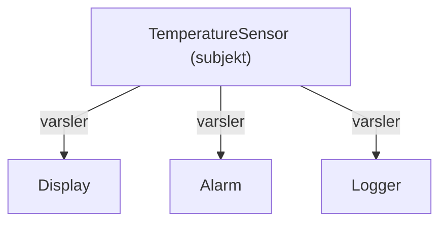

# Observatør-mønsteret

En temperatursensor produserer en avlesning. Flere deler av systemet bryr seg om den avlesningen: en sanntidsvisning, en alarm som utløses over en terskel, en logger som lagrer historikk. Sensoren burde ikke måtte vite om noen av dem — og burde i hvert fall ikke måtte redigeres hver gang du legger til en.

**Observatør-mønsteret** løser dette. Ett objekt (**subjektet**) annonserer når noe endres, og et vilkårlig antall interesserte parter (**observatørene**) reagerer — uten at subjektet vet hvem de er eller hva de gjør. Det er [separasjon av ansvar](soc.md) anvendt på hendelser: det som *produserer* data, avhenger ikke av det som *konsumerer* dem.

Dette kapittelet viser mønsteret med en liten, moderne implementasjon og den ene fellen du må se opp for.

---

## Problemet det løser {#the-problem-it-solves}

Uten mønsteret ender produsenten opp fastkoblet til hver konsument:

```cpp
void onNewReading(double celsius) {
    updateDisplay(celsius);
    if (celsius > 80.0) {
        soundAlarm();
    }
    logToFile(celsius);
}
```

Dette virker, men funksjonen som produserer avlesningen, vet nå om visningen, alarmen *og* loggfilen. Legg til en fjerde konsument — last opp avlesningen til en server — og du må redigere denne funksjonen igjen. Hver konsument er sveiset fast i produsenten.

Det vi vil ha i stedet: sensoren annonserer "her er en ny avlesning", og de som er interessert, reagerer på egen hånd.

---

## Ideen {#the-idea}

- **Subjektet** er tingen som er verdt å følge med på — her, sensoren. Det holder en liste over observatører og tilbyr en måte å **abonnere** på.
- En **observatør** er hvem som helst som har registrert interesse. Når subjektet endres, varsler det hver observatør på listen.

Ett subjekt, mange observatører — en *én-til-mange*-relasjon der subjektet aldri trenger å navngi observatørene enkeltvis.



---

## En moderne implementasjon {#a-modern-implementation}

Moderne C++ uttrykker en observatør som en **callback** (et tilbakekall): en funksjon subjektet lover å kalle. En `std::function<void(double)>` kan holde hva som helst som kan kalles med en `double` — en frittstående funksjon, eller oftest en [lambda](../lambdas.md) — så subjektet holder en liste av dem og kjører hver enkelt når en ny avlesning kommer.

Her er hele greia: en sensor, pluss to observatører som abonnerer på den.

```cpp
#include <functional>
#include <vector>
#include <iostream>

class TemperatureSensor {
public:
    // Registrer en callback som kjøres ved hver nye avlesning.
    void subscribe(std::function<void(double)> observer) {
        observers_.push_back(std::move(observer));
    }

    // Kalles når en fersk avlesning kommer.
    void setReading(double celsius) {
        reading_ = celsius;
        for (const auto& observer : observers_) {
            observer(celsius);          // varsle alle
        }
    }

    double reading() const { return reading_; }

private:
    double reading_ = 0.0;
    std::vector<std::function<void(double)>> observers_;
};

int main() {
    TemperatureSensor sensor;

    // En sanntidsvisning
    sensor.subscribe([](double t) {
        std::cout << "Display: " << t << " C\n";
    });

    // En alarm som bare reagerer over en terskel
    sensor.subscribe([](double t) {
        if (t > 80.0) {
            std::cout << "ALARM: too hot!\n";
        }
    });

    sensor.setReading(72.0);   // visningen slår til; alarmen er stille
    sensor.setReading(95.0);   // visningen slår til; alarmen slår til
}
```

Å kjøre dette skriver ut:

```
Display: 72 C
Display: 95 C
ALARM: too hot!
```

Sensoren vet ingenting om visninger, alarmer eller logger — bare at den holder en liste med funksjoner som skal kalles. `subscribe` legger til én; `setReading` kaller hver av dem etter tur. Å legge til en tredje observatør — si en som laster opp hver avlesning til en server — er bare ett `subscribe`-kall til, og sensoren selv endres aldri.

---

## Pass på levetidene {#watching-out-for-lifetimes}

Dette er den ene virkelige faren. En lambda kan [fange](../lambdas.md#captures) variabler fra omgivelsene sine. Hvis et fanget objekt blir destruert *før* sensoren slutter å kalle callbacken, står callbacken igjen og peker på noe som ikke lenger finnes — den samme [fellen med dinglende referanser](../Chapter4/types_refs_ptrs.md#the-big-lifetime-trap) som i referansekapittelet.

```cpp
TemperatureSensor sensor;

{
    std::string label = "Reactor core";
    sensor.subscribe([&label](double t) {          // fanger label som referanse
        std::cout << label << ": " << t << " C\n";
    });
}   // `label` destrueres her...

sensor.setReading(50.0);   // ...men callbacken peker fortsatt på den — udefinert oppførsel
```

To vaner holder deg trygg:

- **Fang som verdi** når callbacken kan overleve det omsluttende virkeområdet (`[label]` kopierer den), heller enn som referanse.
- Hvis du må fange som referanse, **sørg for at det callbacken fanger, lever lenger enn subjektet**. Subjektet lagrer *kopier* av callbackene, så callbackene i seg selv er trygge; det som kan dingle, er det de peker på som referanse (`label` ovenfor).

> Å fange som referanse (`[&]`) inn i en callback subjektet *lagrer*, er den vanligste måten å skape en dinglende referanse på. Er du i tvil, fang som verdi.

Én ting vår minimale `subscribe` ikke kan, er å **melde av** (unsubscribe): når en callback først ligger i vektoren, finnes det ingen måte å trekke den ut igjen på, fordi en `std::function` ikke har noen identitet å søke etter. Ekte rammeverk løser dette ved å levere tilbake en ID eller et token fra `subscribe` som du senere sender til en `remove` — maskineri vi utelater her for å holde eksempelet lite.

---

## Den klassiske objektorienterte formen {#the-classic-object-oriented-form}

Du vil også møte observatør-mønsteret skrevet på den eldre "Gang of Four"-måten: i stedet for en callback er hver observatør et objekt som implementerer et felles grensesnitt — en direkte anvendelse av [polymorfismen](../Chapter5/polymorphism.md) du allerede har sett.

```cpp
class TemperatureObserver {
public:
    virtual ~TemperatureObserver() = default;
    virtual void onReading(double celsius) = 0;
};
```

En `Display`, en `Alarm` og en `Logger` ville hver arve fra `TemperatureObserver` og overstyre `onReading`. Subjektet lagrer så en liste med `TemperatureObserver`-håndtak og kaller `onReading` på hver — mekanikken er identisk med callback-versjonen.

Forskjellen er **eierskap**. Fordi polymorfisme krever at observatører lagres som peker eller referanse (aldri som verdi — det ville [skåret dem i skiver](../Chapter5/polymorphism.md#object-slicing) (slicing)), eier ikke subjektet observatørene sine. Regelen er: hver observatør må **enten leve lenger enn subjektet, eller melde seg av før den destrueres** — ellers sitter subjektet igjen med et dinglende håndtak. Det er nøyaktig det bokholderiet callback-versjonen slipper unna.

For ny kode, foretrekk callback-formen. Grip etter grensesnitt-formen når en observatør allerede er et fullverdig objekt med flere metoder, eller når et rammeverk du bruker forventer det.

---

## Når du skal bruke det {#when-to-use-it}

- Én kilde til hendelser, flere uavhengige reaksjoner på dem (sensor → visning, alarm, logg).
- Du vil legge til eller fjerne reaksjoner uten å røre kilden.
- Produsenten skal ikke avhenge av konsumentene sine.

Hvis det bare noensinne finnes én konsument, trenger du ikke mønsteret — bare kall den direkte. Observatør-mønsteret gjør nytte for seg når listen over interesserte parter vokser eller endres over tid.

---

## Oppsummering {#summary}

- Observatør-mønsteret lar et **subjekt** varsle mange **observatører** om en endring uten å vite hvem de er.
- I moderne C++ er den enkleste formen en liste med `std::function`-callbacker som observatørene **abonnerer** med — vanligvis lambdaer. Ingen manuell `attach`/`detach`-bokføring nødvendig.
- Det er separasjon av ansvar for hendelser: produsenten av data avhenger ikke av konsumentene sine.
- Hovedfaren er levetider — en lagret callback som fanger som referanse, kan dingle. Fang som verdi, eller sørg for at observatørene lever lenger enn subjektet.
- Den klassiske grensesnittbaserte formen (en virtuell `onReading`) er ekvivalent og gjenbruker polymorfisme, men legger eierskapsbyrden tilbake på deg.
