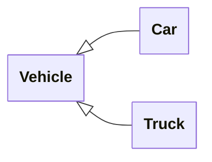
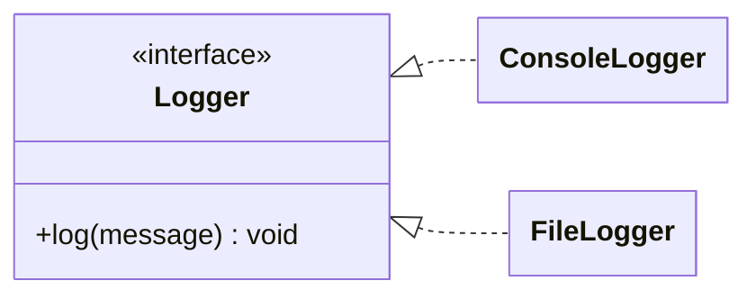
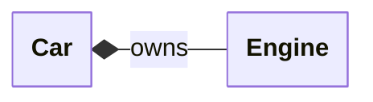
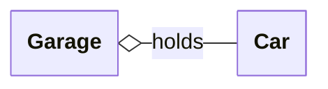
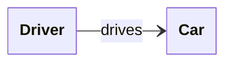
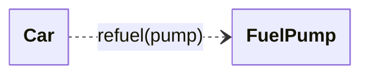
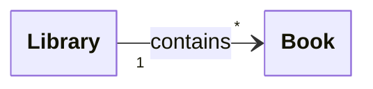
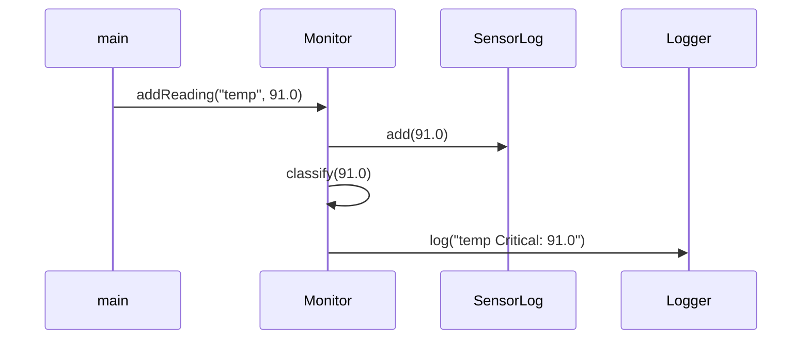

# UML Class Diagrams

Code shows you one class at a time, from the inside. A **UML diagram** shows a whole design from above: which classes exist, what each one holds, and how they connect. UML ("Unified Modeling Language") is the box-and-arrow shorthand engineers use to sketch a design on a whiteboard before writing it, or to explain an existing one to a colleague.

There are many kinds of UML diagram. This page covers the one you will actually meet and use: the **class diagram**. It is the notation behind every `classDiagram` figure in this book (the [Polymorphism](Chapter5/polymorphism.md) chapter, for example), and the kind CLion can generate from your code.

You do not need to memorise the whole language. The goal here is narrow: **read a class diagram, and sketch a simple one yourself**, with each symbol tied back to the C++ it stands for.

---

## Why a picture?

Imagine ten classes spread across twenty files. The relationships — who owns whom, who inherits from whom, who merely talks to whom — are real, but they are scattered across constructors, members, and `#include`s. A class diagram pulls all of that onto one page.

A diagram is cheap. Three boxes and an arrow on a whiteboard can settle an argument about a design in two minutes. It is a *thinking and communication* tool, not a deliverable — do not gold-plate it.

---

## Anatomy of a class

A single class is drawn as a box with up to three stacked compartments: the **name**, the **data members** (attributes), and the **operations** (member functions).

<svg viewBox="0 0 470 210" xmlns="http://www.w3.org/2000/svg" role="img" aria-label="A UML class box for BankAccount has three stacked compartments: the class name on top, the data members (minus balance underscore of type double) in the middle, and the operations (plus deposit, plus withdraw returning bool, plus balance returning double) at the bottom." style="display:block;margin:1rem auto;max-width:470px;width:100%;height:auto;font-family:var(--md-code-font-family,monospace);font-size:13px;" fill="none" stroke="currentColor" stroke-width="1.5">
  <defs>
    <marker id="uml-callout" viewBox="0 0 10 10" refX="8" refY="5" markerWidth="6" markerHeight="6" orient="auto-start-reverse">
      <path d="M0,0 L10,5 L0,10 z" fill="currentColor" stroke="none"/>
    </marker>
  </defs>
  <rect x="30" y="28" width="230" height="160" rx="3"/>
  <line x1="30" y1="62" x2="260" y2="62"/>
  <line x1="30" y1="98" x2="260" y2="98"/>
  <text x="145" y="51" stroke="none" fill="currentColor" text-anchor="middle" font-weight="bold">BankAccount</text>
  <text x="42" y="84" stroke="none" fill="currentColor">- balance_ : double</text>
  <text x="42" y="120" stroke="none" fill="currentColor">+ deposit(amount)</text>
  <text x="42" y="146" stroke="none" fill="currentColor">+ withdraw(amount) : bool</text>
  <text x="42" y="172" stroke="none" fill="currentColor">+ balance() : double</text>
  <line x1="338" y1="45" x2="263" y2="45" marker-end="url(#uml-callout)"/>
  <text x="344" y="49" stroke="none" fill="currentColor" font-size="11" opacity="0.75">class name</text>
  <line x1="338" y1="80" x2="263" y2="80" marker-end="url(#uml-callout)"/>
  <text x="344" y="84" stroke="none" fill="currentColor" font-size="11" opacity="0.75">data members</text>
  <line x1="338" y1="140" x2="263" y2="140" marker-end="url(#uml-callout)"/>
  <text x="344" y="144" stroke="none" fill="currentColor" font-size="11" opacity="0.75">operations</text>
</svg>

That box is exactly this class:

```cpp
class BankAccount {
public:
    explicit BankAccount(double initial) : balance_(initial) {}

    void deposit(double amount);
    bool withdraw(double amount);
    double balance() const;

private:
    double balance_;
};
```

The middle and bottom compartments are often dropped when you only care about how classes connect — a box with just a name is a perfectly good class in a diagram.

### Visibility

The `+`, `-`, and `#` in front of each member are the **visibility markers**. They map straight onto the access specifiers from [Classes](Chapter4/classes.md):

| Symbol | UML term  | C++ keyword |
|:------:|-----------|-------------|
| `+`    | public    | `public:`    |
| `-`    | private   | `private:`   |
| `#`    | protected | `protected:` |

A quick note on the small stuff so it does not trip you up later: tools vary in how they print a member's type. The textbook UML order is `name : type` (as in the box above); other tools — including the Mermaid diagrams later on this page — mirror C++ and put the type first (`double balance_`). Both mean the same thing.

---

## Relationships between classes

The arrows are where class diagrams earn their keep. Each arrow style means something specific, and each one corresponds to a concrete C++ construct. This is the part worth learning well.

### Inheritance — "is-a"

A **solid line with a hollow triangle** pointing at the base class. Read it as "is-a": a `Car` *is a* `Vehicle`.



The triangle always points at the **base** (more general) class.

```cpp
class Vehicle { /* ... */ };
class Car   : public Vehicle { /* ... */ };
class Truck : public Vehicle { /* ... */ };
```

See [Polymorphism](Chapter5/polymorphism.md) for what inheritance buys you.

### Interfaces — "implements"

A **dashed line with a hollow triangle** means a class *implements* an interface. In C++ an "interface" is an abstract base class with pure virtual functions; the marker `<<interface>>` (a **stereotype**) labels it as one.



Solid triangle line = inherit from a concrete class; **dashed** triangle line = implement an interface. The C++ looks the same — you derive and `override` — but the dashed line signals "this base is pure interface, no implementation of its own":

```cpp
class Logger {
public:
    virtual ~Logger() = default;
    virtual void log(const std::string& message) = 0;   // pure virtual
};

class ConsoleLogger : public Logger {
public:
    void log(const std::string& message) override;
};
```

### Composition — "owns a"

A **filled diamond** on the owner. Composition means the part is *owned* by the whole and shares its lifetime: destroy the `Car` and its `Engine` goes with it.



In C++ this is a **value member**, or a `std::unique_ptr` member — something the class owns outright:

```cpp
class Car {
private:
    Engine engine_;   // the Car owns its Engine; they live and die together
};
```

### Aggregation — "uses a"

A **hollow diamond** on the holder. Aggregation is a looser "has-a": the class refers to something whose lifetime is managed *elsewhere*. Park the `Car` somewhere else and it still exists after the `Garage` is gone.



In C++ this is a **reference, a raw pointer, or a `std::shared_ptr`** — the class points at something it does not own:

```cpp
class Garage {
private:
    std::vector<Car*> parked_;   // the Garage refers to Cars it does not own
};
```

> **The composition/aggregation distinction is just ownership.** Filled diamond = "I own this, I clean it up" (a value or `unique_ptr` member). Hollow diamond = "I only borrow this, someone else owns it" (a reference or non-owning pointer). This is the same ownership question from [Values, References & Pointers](Chapter4/types_refs_ptrs.md) and [Memory Management](Chapter5/memory.md), drawn as a picture.

### Association — "knows about"

A plain **open arrow**. The weakest lasting link: one class keeps a reference to another so it can talk to it, with no implied ownership.



In practice association and aggregation overlap a great deal; do not agonise over which to draw. Both say "this object holds onto that one."

### Dependency — "temporarily uses"

A **dashed open arrow**. The most fleeting link: a class uses another only briefly — typically as a function parameter or a local variable — without storing it.



```cpp
class Car {
public:
    void refuel(FuelPump& pump);   // uses a pump for the call, then forgets it
};
```

### The arrows at a glance

| In the diagram | Reads as | In C++ |
|:--------------:|----------|--------|
| <svg width="72" height="22" viewBox="0 0 72 22" xmlns="http://www.w3.org/2000/svg" role="img" aria-label="solid line ending in a hollow triangle" style="vertical-align:middle" fill="none" stroke="currentColor" stroke-width="1.6"><line x1="2" y1="11" x2="50" y2="11"/><path d="M50,4 L70,11 L50,18 Z"/></svg> | **inheritance** — "is-a" | `class Car : public Vehicle` |
| <svg width="72" height="22" viewBox="0 0 72 22" xmlns="http://www.w3.org/2000/svg" role="img" aria-label="dashed line ending in a hollow triangle" style="vertical-align:middle" fill="none" stroke="currentColor" stroke-width="1.6"><line x1="2" y1="11" x2="50" y2="11" stroke-dasharray="5 3"/><path d="M50,4 L70,11 L50,18 Z"/></svg> | **interface** — "implements" | derive from an abstract base, `override` |
| <svg width="72" height="22" viewBox="0 0 72 22" xmlns="http://www.w3.org/2000/svg" role="img" aria-label="solid line ending in a filled diamond" style="vertical-align:middle" fill="none" stroke="currentColor" stroke-width="1.6"><line x1="2" y1="11" x2="48" y2="11"/><path d="M48,11 L59,4 L70,11 L59,18 Z" fill="currentColor"/></svg> | **composition** — "owns; dies with me" | value member or `std::unique_ptr<Part>` |
| <svg width="72" height="22" viewBox="0 0 72 22" xmlns="http://www.w3.org/2000/svg" role="img" aria-label="solid line ending in a hollow diamond" style="vertical-align:middle" fill="none" stroke="currentColor" stroke-width="1.6"><line x1="2" y1="11" x2="48" y2="11"/><path d="M48,11 L59,4 L70,11 L59,18 Z"/></svg> | **aggregation** — "uses; owned elsewhere" | reference, raw pointer, or `std::shared_ptr` |
| <svg width="72" height="22" viewBox="0 0 72 22" xmlns="http://www.w3.org/2000/svg" role="img" aria-label="solid line ending in an open arrow" style="vertical-align:middle" fill="none" stroke="currentColor" stroke-width="1.6"><line x1="2" y1="11" x2="69" y2="11"/><path d="M58,4 L70,11 L58,18"/></svg> | **association** — "knows about" | a member that refers to another object |
| <svg width="72" height="22" viewBox="0 0 72 22" xmlns="http://www.w3.org/2000/svg" role="img" aria-label="dashed line ending in an open arrow" style="vertical-align:middle" fill="none" stroke="currentColor" stroke-width="1.6"><line x1="2" y1="11" x2="69" y2="11" stroke-dasharray="5 3"/><path d="M58,4 L70,11 L58,18"/></svg> | **dependency** — "temporarily uses" | a function parameter or local variable |

---

## Multiplicity: how many?

Numbers at the ends of a line say *how many* objects take part. A `Library` has one-to-many `Book`s:



| Notation | Meaning |
|:--------:|---------|
| `1`      | exactly one |
| `0..1`   | zero or one (optional) |
| `*`      | zero or more |
| `1..*`   | one or more |

The mapping to C++ is direct: a "one" end is usually a single member; a "many" end is a container.

```cpp
class Library {
private:
    std::vector<Book> books_;   // the "*" end: many Books
};
```

---

## Putting it together

Here is a small monitoring system that uses most of the vocabulary at once: a `Monitor` that **owns** several `SensorLog`s, **uses** a `Logger` to report, and **classifies** each reading into a `Status` as it goes.

```mermaid
%%{init: {'class': {'hideEmptyMembersBox': true}}}%%
classDiagram
    class Monitor {
        +addReading(name, value) void
    }
    class SensorLog {
        -vector~double~ readings_
        +add(value) void
        +max() double
    }
    class Logger {
        <<interface>>
        +log(message) void
    }
    class Status {
        <<enumeration>>
        Ok
        Warning
        Critical
    }
    Monitor "1" *-- "1..*" SensorLog : owns
    Monitor o-- Logger : uses
    Logger <|.. ConsoleLogger
    Logger <|.. FileLogger
    Monitor ..> Status : addReading()
```



Read straight off the picture: the `Monitor` **owns** one-or-more `SensorLog`s (filled diamond), it **uses** a `Logger` it does not own (hollow diamond), `ConsoleLogger` and `FileLogger` **implement** the `Logger` interface (dashed triangles), and `Monitor` **depends on** the `Status` enumeration — `addReading()` runs the new reading through `classify()` and logs the result, using the `Status` only as a local value (dashed arrow). The C++ skeleton falls out almost mechanically:

```cpp
enum class Status { Ok, Warning, Critical };
Status classify(double reading);   // maps a single reading to a status

class SensorLog {
public:
    void   add(double value);
    double max() const;
private:
    std::vector<double> readings_;
};

class Logger {
public:
    virtual ~Logger() = default;
    virtual void log(const std::string& message) = 0;
};

class Monitor {
public:
    explicit Monitor(Logger& logger) : logger_(logger) {}

    // Record a reading, classify it, and log its status.
    void addReading(const std::string& name, double value);

private:
    std::map<std::string, SensorLog> logs_;   // owns (filled diamond)
    Logger& logger_;                          // uses (hollow diamond)
};
```

`classify` is a free helper function rather than a class, so it gets no box of its own — a class diagram shows **types** and how they relate, not every function. The diamonds, meanwhile, chose the member types for you: the owned `SensorLog`s are stored **by value** in the map, while the borrowed `Logger` is held **by reference**.

---

## A glance at behaviour: sequence diagrams

A class diagram shows **structure** — what exists. When you need to show **behaviour** — who calls whom, and in what order — UML offers the **sequence diagram**. Time runs downward; each arrow is a call.



You will not need to draw these often in this course, but they are invaluable for explaining a tricky interaction at a glance.

---

## When to reach for UML

- **To design before you code.** Sketch the classes and arrows; spotting an awkward relationship on paper is far cheaper than discovering it after you have written it.
- **To understand code you did not write.** CLion can generate a diagram from existing source — right-click a class and choose **Diagrams ▸ Show Diagram**. It is the fastest way to get the shape of an unfamiliar codebase.
- **To explain a design to someone else.** A picture in a pull request or a report says in seconds what a wall of prose cannot.

And when *not* to: do not turn a quick sketch into a formal artefact you have to maintain. The code is the source of truth. A diagram is worth drawing only as long as it is helping you think or communicate.

---

## Summary

- A **class diagram** shows the shape of a design: the classes and how they relate.
- A class is a box of up to three compartments — **name**, **data members**, **operations** — with `+` `-` `#` for public/private/protected.
- The arrows each map to C++: hollow triangle = **inheritance** (solid) or **interface** (dashed); **filled diamond** = composition (you own it, by value or `unique_ptr`); **hollow diamond** = aggregation (you borrow it, by reference or pointer); open arrows = looser "knows about" / "temporarily uses".
- Composition vs. aggregation is simply the **ownership** question from [Memory Management](Chapter5/memory.md), drawn as a diamond.
- **Multiplicity** (`1`, `*`, `1..*`) tells you single member vs. container.
- UML is a tool for thinking and communicating, not a deliverable. Sketch freely; do not gold-plate.
